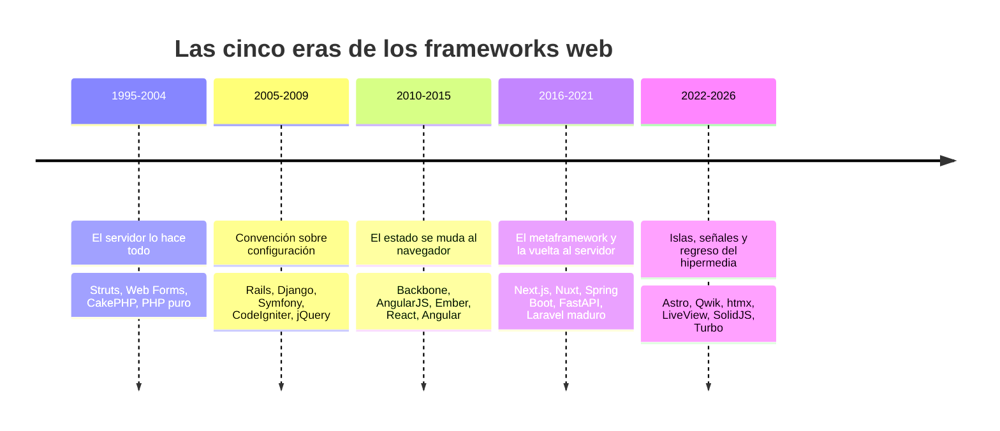
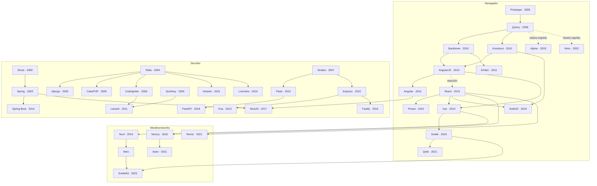

# 🗺️ Atlas de frameworks

> [⬅️ Programa](../curriculum/README.md) · [🗂️ Índice completo](frameworks.md) · [🧭 Taxonomía](../docs/TAXONOMY.md) · [📖 Fuentes](../docs/BIBLIOGRAPHY.md)

El Atlas es la **segunda capa** del programa. Mientras el núcleo implementa **un solo
contrato en cinco ecosistemas** y lo verifica en cada entrega, el Atlas te deja
**reconocer 138 tecnologías por su lugar en la historia**: de dónde vino cada
una, qué problema resolvió, qué dejó abierto y quién recogió el testigo.

La tesis es la misma que la del programa: **aprende el representante, reconoce
la familia entera**. Nadie aprende 138 frameworks. Cualquiera puede aprender ocho
ideas y ver esas ocho ideas repetirse con nombres distintos durante veinte años.

> Este material es **de lectura**. No se ejecuta en integración continua: lo que
> se ejecuta son los cinco laboratorios del contrato. Cada entrada del Atlas se
> fecha y enlaza a su documentación oficial, porque las versiones y el gobierno
> cambian mucho más rápido que la historia.

## 🌍 Cada lenguaje tiene sus frameworks — y no son intercambiables

Esta es la observación que organiza el Atlas. Un framework no es una idea
flotante que se implementa igual en todas partes: **hereda las restricciones y
las virtudes de su lenguaje**, y por eso los ecosistemas no convergen.

| Ecosistema | Tecnologías | Qué lo caracteriza |
| --- | ---: | --- |
| [JavaScript y TypeScript](ecosistemas/javascript.md) | 64 | El único que corre en cliente y servidor; renovación acelerada y fatiga asociada |
| [JVM](ecosistemas/jvm.md) | 14 | Especificaciones con varias implementaciones; horizontes de mantenimiento de décadas |
| [PHP](ecosistemas/php.md) | 12 | Nació dentro del servidor web; el ecosistema que más se subestima y más web mueve |
| [Python](ecosistemas/python.md) | 12 | De «baterías incluidas» a la validación derivada de tipos |
| [.NET](ecosistemas/dotnet.md) | 10 | Un solo proveedor marca el ritmo; migraciones grandes pero documentadas |
| [Go](ecosistemas/go.md) | 7 | Biblioteca estándar tan capaz que el framework es opcional |
| [Rust](ecosistemas/rust.md) | 6 | El compilador como parte del diseño del framework |
| [Ruby](ecosistemas/ruby.md) | 5 | Origen de las convenciones que todos copiaron |
| [BEAM](ecosistemas/beam.md) | 2 | Concurrencia y tolerancia a fallos como propiedad del runtime |
| [Apple](ecosistemas/apple.md) | 2 | Un solo proveedor, sin código abierto, sin estrategia de salida |
| [Dart](ecosistemas/dart.md) | 1 | Un lenguaje creado para sostener un framework |
| [Nativo (C/C++)](ecosistemas/nativo.md) | 2 | Los frameworks de interfaz más longevos que siguen en uso |
| [Plataformas](ecosistemas/cloud.md) | 1 | No son frameworks; condicionan a todos |

👉 **[Índice completo con las 138 tecnologías](frameworks.md)** · **[14 fichas a fondo](fichas/README.md)**

## 🕰️ Las cinco eras

La historia de los frameworks web no es una línea recta hacia el cliente. Es un
péndulo, y saber en qué punto del péndulo estás evita repetir discusiones que ya
se tuvieron.

### Qué se aprende de cada giro

| Era | El problema que resolvía | El problema que creó |
| --- | --- | --- |
| **Servidor lo hace todo** | No había nada más; el navegador apenas ejecutaba código | Cada interacción costaba una recarga completa |
| **Convención sobre configuración** | La configuración XML era más larga que el programa | Lo implícito falla por sorpresa cuando no se conoce la convención |
| **Estado en el navegador** | La recarga completa era insoportable para aplicaciones ricas | Se duplicó el modelo de datos y la lógica en dos sitios |
| **Metaframework** | Reunificar cliente y servidor bajo un mismo enrutado | Acoplamiento a plataformas concretas y coste de hidratación |
| **Islas e hipermedia** | Enviar megabytes de JavaScript para mostrar texto | Fragmentación: hoy conviven cuatro modelos incompatibles |

Ninguna era es superior. Cada una resolvió el dolor de la anterior y creó el
suyo. Quien solo conoce la era en la que empezó confunde su punto de partida con
el estado natural del campo [@fowler-poeaa].

## 🌳 Genealogía: quién viene de quién

Las flechas indican **influencia declarada o linaje directo**, no equivalencia.

Tres lecturas que este grafo hace evidentes:

1. **Rails es el nodo más influyente del campo.** Django, CakePHP, CodeIgniter,
   Grails, Sails y Laravel citan sus convenciones. Casi nadie que use Laravel
   hoy ha escrito una línea de Ruby.
2. **Sinatra generó más descendencia que muchos frameworks completos.** El estilo
   «verbo, ruta, bloque» está en Flask, Express, Slim y una docena más.
3. **htmx y Alpine cierran el círculo con jQuery.** Veinte años después, la idea
   de añadir comportamiento a HTML que ya existe volvió con otro vocabulario.

## 🧭 Cómo usar el Atlas

| Si quieres… | Ve a |
| --- | --- |
| Ubicar una tecnología concreta | [Índice completo](frameworks.md) |
| Entender por qué un ecosistema es como es | La página de su [ecosistema](ecosistemas/) |
| Estudiar un caso a fondo | Las [**14 fichas**](fichas/README.md) |
| Clasificar correctamente antes de comparar | [`docs/TAXONOMY.md`](../docs/TAXONOMY.md) y el [módulo 00](../curriculum/00-taxonomia-y-diagnostico.md) |
| Elegir para un producto real | El [módulo 11](../curriculum/11-seleccion-y-sostenibilidad.md) |

## ⚖️ Criterio de inclusión

Una tecnología entra en el Atlas si cumple **al menos una** de estas condiciones,
y la entrada dice cuál:

- **Se usa hoy** de forma verificable, con documentación oficial mantenida.
- **Aportó una idea** que sobrevivió a su propio declive (Backbone, Knockout).
- **Su fracaso enseña algo** que el éxito de otros no enseña (AngularJS, Web
  Forms, Gatsby).
- **Es el representante de una familia** que de otro modo quedaría fuera.

Y una condición que **no** es criterio de inclusión: la popularidad. El número de
estrellas o de descargas no aparece en ninguna entrada de este catálogo, porque
no responde a ninguna de las preguntas del módulo 11.

## 🔄 Qué caduca y qué no

| Dato | Caduca | Por qué |
| --- | --- | --- |
| Año de aparición, autoría, linaje | **No** | Es historia |
| Idea aportada, problema que resolvió | **No** | Es historia |
| Versión actual, herramientas, rendimiento | **Sí, rápido** | Consulta siempre la documentación oficial enlazada |
| Licencia y gobierno | **Sí, sin avisar** | Ha cambiado varias veces en este mismo catálogo |
| Estado (activo, mantenimiento, histórico) | **Sí** | Se revisa en cada actualización del repositorio |

`node scripts/refresh-catalog.mjs` contrasta cada enlace y cada identificador de
licencia con su fuente y avisa de la deriva.

## Fuentes

- [@fowler-poeaa] Fowler, Martin. *Patterns of Enterprise Application Architecture*. Addison-Wesley, 2002. ISBN 9780321127426 — <https://openlibrary.org/isbn/9780321127426>
