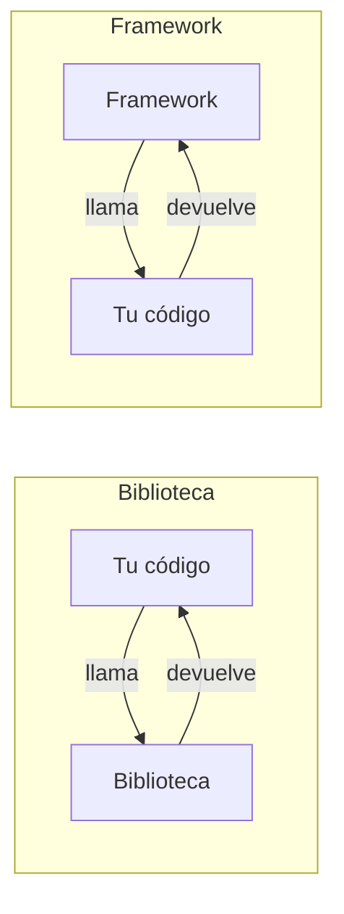

# Módulo 00 — Taxonomía y diagnóstico

> El módulo no enseña ningún framework. Enseña a nombrar con precisión lo que
> se va a comparar durante las 180 horas siguientes. Un vocabulario impreciso
> produce comparaciones imposibles de defender.

## Prerrequisitos y nivel

**Nivel:** introductorio. **Duración:** 6 horas.

Se requiere haber escrito y ejecutado algún programa, en cualquier lenguaje, y
saber usar una terminal. No se requiere experiencia previa con frameworks.

Antes de empezar, comprueba tu entorno:

```bash
node --version   # se espera 22 o superior
corepack enable  # habilita pnpm sin instalarlo globalmente
pnpm --version
```

## Objetivos observables

Al terminar, la persona es capaz de:

| # | Objetivo | Verbo de la taxonomía revisada [@anderson-krathwohl-taxonomy] | Evidencia |
| --- | --- | --- | --- |
| 1 | Clasificar una tecnología dada en lenguaje, runtime, biblioteca, framework, metaframework, SDK, ORM, CMS o plataforma | Comprender | ficha de clasificación con justificación |
| 2 | Distinguir quién llama a quién entre biblioteca y framework | Analizar | diagrama de control invertido |
| 3 | Identificar el destino de producto de una tecnología (web, API, móvil, escritorio, datos) | Aplicar | matriz destino × tecnología |
| 4 | Leer la licencia y la política de versiones de una dependencia | Evaluar | ficha de licencia y compatibilidad |
| 5 | Rechazar una comparación mal planteada explicando el defecto | Evaluar | crítica escrita de una comparación pública |

Los objetivos se redactan con verbos observables porque un objetivo que no puede
observarse tampoco puede evaluarse [@anderson-krathwohl-taxonomy].

## Concepto independiente del framework

La distinción operativa no es de tamaño ni de popularidad: es **quién posee el
flujo de control**.



A una biblioteca la llamas tú. Un framework te llama a ti: tú rellenas huecos que
él define, en momentos que él decide. Esa inversión es la razón por la que un
framework impone estructura y una biblioteca no [@martin-clean-architecture].

### Glosario operativo

| Término | Definición operativa | Prueba que lo distingue |
| --- | --- | --- |
| **Lenguaje** | Gramática y semántica de un texto ejecutable | Tiene especificación; no se «instala» en un proyecto |
| **Runtime** | Programa que ejecuta ese texto y le ofrece servicios del sistema | Tiene versión propia y ciclo de soporte independiente del código |
| **Biblioteca** | Conjunto de funciones que tu código invoca | Puedes usar una parte y olvidar el resto |
| **Framework** | Esqueleto que invoca tu código en puntos de extensión definidos | Define el arranque, el ciclo de vida y el orden |
| **Metaframework** | Framework construido sobre otro, que añade enrutamiento, construcción y renderizado | No existe sin su base |
| **SDK** | Kit para consumir una plataforma concreta | Su valor desaparece si abandonas esa plataforma |
| **ORM** | Traductor entre estructuras del lenguaje y un almacén de datos | Es un mapeador, no una base de datos [@fowler-poeaa] |
| **CMS** | Aplicación completa de gestión de contenidos, extensible | Se «administra», no solo se «programa» |
| **Plataforma** | Entorno operado por un tercero donde tu código se ejecuta | Tiene contrato comercial y de disponibilidad |

Confundir estos términos tiene consecuencias caras: se compara un ORM con una
base de datos, un metaframework con una biblioteca de interfaz, o una plataforma
con un framework, y la conclusión resultante no significa nada. La disciplina de
nombrar con precisión antes de decidir es la base de cualquier razonamiento
arquitectónico posterior [@richards-ford-fundamentals].

### Cinco preguntas de clasificación

1. ¿Quién arranca el proceso: tu código o el suyo?
2. ¿Puedes usar una parte y descartar el resto sin reescribir el arranque?
3. ¿Define el orden del ciclo de vida (inicio, petición, error, cierre)?
4. ¿Existe sin otra tecnología por debajo?
5. ¿Lo ejecutas tú o lo ejecuta un tercero bajo contrato?

## Anatomía comparada

Se aplican las cinco preguntas a cinco tecnologías del catálogo del repositorio.
El resultado es una clasificación, no una recomendación.

| Tecnología | ¿Arranca tu código? | ¿Uso parcial? | ¿Define ciclo de vida? | ¿Depende de otra? | Clasificación |
| --- | --- | --- | --- | --- | --- |
| React | No, lo arrancas tú | Sí | Solo el de sus componentes | Necesita un runtime y un empaquetador | biblioteca de interfaz |
| Next.js | Sí, con su propio servidor y construcción | No | Sí (rutas, renderizado, caché) | Sobre React | metaframework |
| Express | Sí, posee el bucle de peticiones | Parcial | Sí (middleware, errores) | Sobre Node.js | framework web minimalista |
| Prisma | No | Sí | No | Sobre una base de datos | ORM / mapeador |
| Node.js | Es quien ejecuta | No aplica | Ofrece el bucle de eventos | Es la base | runtime |

Observa que «framework minimalista» y «biblioteca» no son sinónimos: Express
posee el bucle de peticiones aunque su superficie de API sea pequeña.

## Implementación mínima

La distinción se vuelve tangible en veinte líneas. Guarda este archivo como
`taxonomia.mjs` y ejecútalo con `node taxonomia.mjs`.

```javascript
// Uso como BIBLIOTECA: tu código decide cuándo llamar.
const formatear = (tarea) => `${tarea.done ? "[x]" : "[ ]"} ${tarea.title}`;
console.log(formatear({ title: "Leer el módulo 00", done: false }));

// Uso como FRAMEWORK: tú registras un hueco y otro decide cuándo llamarlo.
function crearMiniFramework() {
  const rutas = new Map();
  return {
    registrar(ruta, manejador) {
      rutas.set(ruta, manejador);
    },
    // El framework posee el orden: valida, resuelve, normaliza errores.
    despachar(ruta, entrada) {
      const manejador = rutas.get(ruta);
      if (!manejador) return { status: 404, body: { code: "ROUTE_NOT_FOUND" } };
      try {
        return { status: 200, body: manejador(entrada) };
      } catch (error) {
        return { status: 400, body: { code: "HANDLER_ERROR", detail: error.message } };
      }
    },
  };
}

const app = crearMiniFramework();
app.registrar("/tasks", (entrada) => {
  if (!entrada.title) throw new Error("title requerido");
  return { id: "t1", title: entrada.title, done: false };
});

console.log(app.despachar("/tasks", { title: "Clasificar cinco tecnologías" }));
console.log(app.despachar("/tasks", {}));
console.log(app.despachar("/ninguna", {}));
```

Nunca invocaste `manejador` directamente: lo registraste y el despachador decidió
cuándo, con qué y qué hacer si fallaba. Eso es inversión de control, y es el eje
del módulo 02.

## Pruebas compartidas

La prueba no comprueba el framework: comprueba la propiedad que define la
clasificación.

```javascript
// taxonomia.test.mjs — ejecutar con: node --test taxonomia.test.mjs
import assert from "node:assert/strict";
import { test } from "node:test";

test("el framework normaliza el error del manejador en vez de propagarlo", () => {
  const app = crearMiniFramework();
  app.registrar("/tasks", () => {
    throw new Error("title requerido");
  });
  const respuesta = app.despachar("/tasks", {});
  assert.equal(respuesta.status, 400);
  assert.equal(respuesta.body.code, "HANDLER_ERROR");
});

test("una ruta desconocida no llega a ningún manejador", () => {
  const app = crearMiniFramework();
  assert.equal(app.despachar("/ninguna", {}).status, 404);
});
```

Estas pruebas usan solo el ejecutor incorporado en el runtime [@nodejs-docs], sin
instalar nada. El repositorio mantiene deliberadamente esa ruta de bajo consumo.

## Seguridad y accesibilidad

En este módulo la superficie de riesgo no está en el código, sino en lo que se
incorpora al proyecto.

- **Licencias.** Antes de adoptar una dependencia, identifica su licencia en la
  lista SPDX [@spdx-licenses] y comprueba si está aprobada por la OSI
  [@osi-licenses]. «Es de código abierto» no es una respuesta: MIT, Apache-2.0,
  GPL-3.0 y BSL-1.1 imponen obligaciones distintas.
- **Política de versiones.** Una dependencia que declara versionado semántico
  [@semver] promete que un cambio mayor puede romper tu código y uno menor no.
  Verifica que lo cumpla en su historial; declararlo no es cumplirlo.
- **Accesibilidad.** El material del programa se lee también con lector de
  pantalla: las tablas comparativas llevan encabezados reales y los diagramas
  van acompañados del texto que los explica. Un diagrama sin texto equivalente
  es contenido perdido para parte de tus estudiantes.

## Errores frecuentes y diagnóstico

| Síntoma | Causa probable | Diagnóstico |
| --- | --- | --- |
| «Comparamos React con Angular y React gana en tamaño» | Se compara una biblioteca con un framework completo | Aplica la pregunta 1: ¿quién arranca? Si difieren, la métrica no es comparable |
| «Este ORM es más rápido que PostgreSQL» | Se compara un mapeador con un motor de datos | Aplica la pregunta 4: uno depende del otro |
| «Migrar a otro framework es cambiar el import» | Se ignoró la inversión de control | Localiza quién define el arranque y el ciclo de vida |
| «Tiene más estrellas, es mejor» | Popularidad usada como criterio de calidad | Exige un criterio con evidencia: soporte, licencia, mantenimiento, ajuste al producto |
| `corepack: command not found` | Runtime anterior al soportado | Comprueba `node --version`; se requiere 22 o superior |
| «Es enterprise» | Afirmación sin contenido verificable | Pide la definición operativa y la evidencia |

La disciplina de nombrar el defecto antes de opinar es lo que separa una
comparación técnica de una preferencia [@hunt-thomas-pragmatic].

## Comprobación de recuerdo

Respóndelas de memoria, en voz alta o por escrito, antes de mirar arriba. La
recuperación activa retiene más que releer [@anderson-krathwohl-taxonomy].

1. ¿Cuál es la única pregunta que distingue biblioteca de framework?
2. Da un ejemplo de metaframework y di sin cuál base no existiría.
3. ¿Por qué comparar un ORM con una base de datos es un error de categoría?
4. ¿Qué promete exactamente el versionado semántico en un cambio menor?
5. Nombra dos obligaciones distintas que imponen dos licencias que conozcas.

**Repaso espaciado.** Vuelve a estas cinco preguntas al terminar el módulo 02 y
otra vez al terminar el módulo 05. La distribución en el tiempo es lo que
consolida la clasificación.

## Reto de transferencia

Elige **tres** tecnologías que uses o quieras usar y que **no** estén en la tabla
de arriba. Para cada una, produce una ficha con:

1. clasificación según las cinco preguntas, con la respuesta a cada una;
2. destino de producto declarado por su documentación oficial, con el enlace;
3. licencia SPDX exacta [@spdx-licenses] y qué te obliga a hacer;
4. política de versiones declarada y una evidencia de su historial;
5. una comparación que **no** sería válida con esa tecnología, y por qué.

Escribe la ficha con la plantilla de `templates/FRAMEWORK_TEMPLATE.md`. Si una de
las cinco respuestas no la encuentras en la fuente oficial, decláralo como hueco:
un hueco declarado es información; un hueco rellenado por intuición, no.

## Criterios de evaluación

| Criterio | Insuficiente | Suficiente | Sólido | Ejemplar |
| --- | --- | --- | --- | --- |
| Clasificación | Usa los términos como sinónimos | Clasifica correctamente con ayuda | Clasifica y justifica con las cinco preguntas | Detecta y corrige clasificaciones erróneas ajenas |
| Fuentes | Cita blogs sin autoría | Cita documentación oficial | Cita documentación oficial con fecha de consulta | Contrasta documentación con evidencia del historial |
| Licencias | No las revisa | Identifica la licencia | Identifica obligaciones concretas | Anticipa un conflicto de licencias en el producto |
| Crítica | Acepta comparaciones publicadas | Detecta comparaciones mal planteadas | Explica el defecto de categoría | Reformula la comparación para que sea válida |

Se aprueba el módulo con **Sólido** en clasificación y fuentes.

## Fuentes

- [@richards-ford-fundamentals] Richards, Mark; Ford, Neal. *Fundamentals of Software Architecture: An Engineering Approach*. O'Reilly Media, 2020. ISBN 9781492043454 — <https://openlibrary.org/isbn/9781492043454>
- [@fowler-poeaa] Fowler, Martin. *Patterns of Enterprise Application Architecture*. Addison-Wesley, 2002. ISBN 9780321127426 — <https://openlibrary.org/isbn/9780321127426>
- [@martin-clean-architecture] Martin, Robert C. *Clean Architecture: A Craftsman's Guide to Software Structure and Design*. Pearson, 2017. ISBN 9780134494166 — <https://openlibrary.org/isbn/9780134494166>
- [@hunt-thomas-pragmatic] Hunt, Andrew; Thomas, David. *The Pragmatic Programmer*, 20.º aniversario. Addison-Wesley, 2019. ISBN 9780135957059 — <https://openlibrary.org/isbn/9780135957059>
- [@anderson-krathwohl-taxonomy] Anderson, Lorin W.; Krathwohl, David R. *A Taxonomy for Learning, Teaching, and Assessing*. Longman, 2001. ISBN 9780321084057 — <https://openlibrary.org/isbn/9780321084057>
- [@semver] Semantic Versioning 2.0.0 — <https://semver.org/>
- [@spdx-licenses] SPDX License List, Linux Foundation — <https://spdx.org/licenses/>
- [@osi-licenses] OSI Approved Licenses, Open Source Initiative — <https://opensource.org/licenses>
- [@nodejs-docs] Node.js API Documentation (v22 LTS), OpenJS Foundation — <https://nodejs.org/docs/latest-v22.x/api/>
