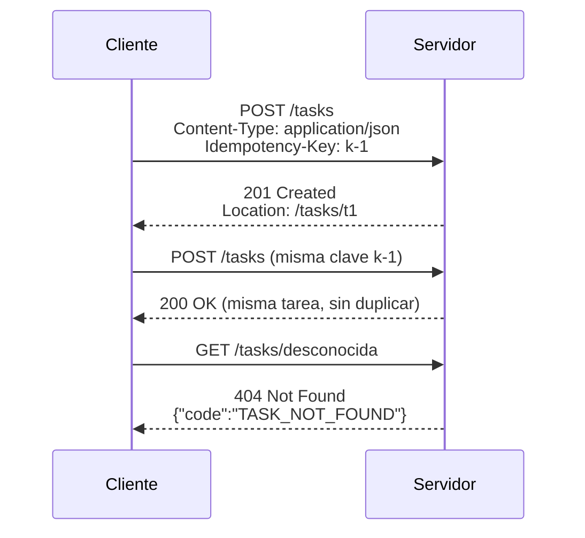

# Módulo 01 — HTTP, eventos y contratos

> Todo framework web es una forma de escribir menos HTTP a mano. Quien no sabe
> qué está escribiendo el framework por él, no puede diagnosticar cuándo lo
> escribe mal.

## Prerrequisitos y nivel

**Nivel:** introductorio. **Duración:** 16 horas. Requiere el módulo 00.

Este módulo se implementa **sin ningún framework**: solo el runtime. Es
deliberado. La referencia de `labs/01-http-contract/reference-node/` es el patrón
de medida contra el que se comparan todas las implementaciones posteriores.

## Objetivos observables

1. Explicar qué significan las propiedades **segura**, **idempotente** y
   **cacheable** de un método, y clasificar `GET`, `POST`, `PUT`, `PATCH` y
   `DELETE` según ellas [@rfc9110].
2. Elegir el código de estado correcto para ocho situaciones dadas, justificando
   la elección con la semántica normativa y no con la costumbre [@rfc9110].
3. Emitir errores con una forma estable y documentada [@rfc9457].
4. Escribir y validar un contrato en OpenAPI que describa el mismo servicio
   [@openapi-spec].
5. Implementar un servidor que cumpla el contrato usando solo el runtime
   [@nodejs-docs].
6. Explicar qué cambia y qué no cambia entre HTTP/1.1, HTTP/2 y HTTP/3.

## Concepto independiente del framework

Una petición HTTP es un mensaje con **método**, **destino**, **campos de
cabecera** y **contenido opcional**; una respuesta es un **código de estado**,
**campos** y **contenido opcional** [@rfc9110]. Nada más. Todo framework se
reduce a construir y descomponer estos mensajes.



### Las tres propiedades que hay que saber de memoria

| Propiedad | Significado normativo [@rfc9110] | Consecuencia práctica |
| --- | --- | --- |
| **Segura** | No se pide al servidor que cambie estado | Un rastreador puede recorrerlo sin dañar nada |
| **Idempotente** | Repetir la petición tiene el mismo efecto que hacerla una vez | El cliente puede reintentar tras un fallo de red |
| **Cacheable** | La respuesta puede almacenarse y reutilizarse | Una capa intermedia puede responder sin llegar al origen [@rfc9111] |

| Método | Segura | Idempotente | Cacheable |
| --- | :---: | :---: | :---: |
| `GET` | sí | sí | sí |
| `HEAD` | sí | sí | sí |
| `PUT` | no | sí | no |
| `DELETE` | no | sí | no |
| `POST` | no | **no** | solo con indicación explícita |
| `PATCH` | no | **no** por definición [@rfc5789] | no |

Que `POST` no sea idempotente es la razón de existir de `Idempotency-Key` en el
contrato de este repositorio: sin una clave que el servidor recuerde, un
reintento tras un tiempo de espera agotado crea un recurso duplicado.

### Códigos de estado: elegir por semántica, no por costumbre

| Situación | Código | Por qué |
| --- | --- | --- |
| Se creó un recurso | `201` + `Location` | La respuesta indica dónde vive lo creado |
| Se aceptó para procesar después | `202` | El trabajo aún no terminó |
| Operación correcta sin contenido | `204` | No hay cuerpo que devolver |
| El cuerpo no es JSON válido | `400` | El mensaje está mal formado |
| Falta o es inválida la credencial | `401` | Falta autenticación |
| Hay credencial pero no permiso | `403` | Falla la autorización, no la identidad |
| El recurso no existe | `404` | No hay representación |
| El método no aplica a ese recurso | `405` + `Allow` | El recurso existe, el verbo no |
| Conflicto con el estado actual | `409` | Por ejemplo, dos ediciones concurrentes |
| El cuerpo es válido pero viola una regla | `422` | Sintaxis correcta, semántica no |
| Se superó el ritmo permitido | `429` + `Retry-After` | El cliente debe esperar |

### El transporte cambia; la semántica no

HTTP/1.1 [@rfc9112], HTTP/2 [@rfc9113] y HTTP/3 [@rfc9114] cambian cómo viajan
los mensajes —una conexión por petición, multiplexación sobre TCP, multiplexación
sobre QUIC— pero **no** cambian qué significa `GET` ni qué significa `404`. Por
eso el módulo enseña primero la semántica: es la parte que no caduca. La latencia,
en cambio, sí depende del transporte y del recorrido físico [@grigorik-hpbn].

## Anatomía comparada

El mismo `POST /tasks` en tres niveles de abstracción:

| Etapa | Sin framework (runtime) | Framework minimalista | Framework con convenciones |
| --- | --- | --- | --- |
| Enrutar | `if (req.method === "POST" && url.pathname === "/tasks")` | `app.post("/tasks", ...)` | Anotación o convención de archivo |
| Leer el cuerpo | Acumular fragmentos del flujo y `JSON.parse` [@rfc8259] | Middleware de análisis | Automático, con esquema |
| Validar | Comprobaciones escritas a mano | Función de validación llamada por ti | Declarativa, ejecutada por el framework |
| Error | Construir el objeto y el código | Manejador de errores registrado | Traducción automática de excepciones |
| Responder | `res.writeHead(...); res.end(...)` | `res.status(201).json(...)` | Retorno del manejador |

En las tres columnas se envía el mismo mensaje por el cable. Cambia cuánto código
propio hace falta y cuánto comportamiento queda implícito. El coste del
comportamiento implícito se paga al diagnosticar.

## Implementación mínima

El repositorio incluye la referencia completa en
[`labs/01-http-contract/reference-node/server.mjs`](../labs/01-http-contract/reference-node/server.mjs).
Su núcleo es este:

```javascript
import http from "node:http";

const tareas = new Map();
const idempotencia = new Map();

function json(res, status, body, headers = {}) {
  const payload = JSON.stringify(body);
  res.writeHead(status, {
    "content-type": "application/json; charset=utf-8",
    "content-length": Buffer.byteLength(payload),
    ...headers,
  });
  res.end(payload);
}

async function leerJson(req, limite = 64 * 1024) {
  let total = 0;
  const trozos = [];
  for await (const trozo of req) {
    total += trozo.length;
    // El límite se comprueba mientras se lee: si se comprueba al final,
    // un cuerpo enorme ya consumió la memoria.
    if (total > limite) throw Object.assign(new Error("payload"), { code: "PAYLOAD_TOO_LARGE" });
    trozos.push(trozo);
  }
  if (!trozos.length) return {};
  return JSON.parse(Buffer.concat(trozos).toString("utf8"));
}
```

Puedes ejecutar la referencia y sus pruebas sin instalar nada:

```bash
node --test labs/01-http-contract/reference-node/server.test.mjs
```

## Pruebas compartidas

Las pruebas de aceptación viven en
[`contracts/taskflow/ACCEPTANCE.md`](../contracts/taskflow/ACCEPTANCE.md) y son
las **mismas** para todas las implementaciones del programa. Comprueban el
contrato, no la implementación:

1. `GET /health` responde `200` con un cuerpo que declara el estado.
2. `POST /tasks` sin `title` responde `422` con un código de error estable.
3. `POST /tasks` con `title` responde `201` y una cabecera `Location`.
4. Repetir `POST /tasks` con la misma `Idempotency-Key` **no** crea un segundo
   recurso.
5. `GET /tasks/{id}` inexistente responde `404` con `TASK_NOT_FOUND`.
6. Un cuerpo que no es JSON responde `400`, no `500`.
7. Un cuerpo mayor que el límite responde `413`, no agota la memoria.

Si una implementación necesita cambiar una de estas pruebas para pasar, la
comparación deja de ser válida: se cambió el problema para favorecer la
herramienta.

## Seguridad y accesibilidad

- **Errores que no filtran.** El cuerpo del error lleva un código estable y un
  mensaje para humanos; nunca la traza, la consulta SQL ni la ruta del archivo.
  El formato de `Problem Details` [@rfc9457] da una estructura ya acordada.
- **Límite de tamaño.** Todo cuerpo entrante necesita un límite comprobado
  durante la lectura. Sin él, un solo cliente agota la memoria del proceso.
- **Origen cruzado.** Si un navegador va a llamar a la API, `CORS` no es un
  adorno: define qué orígenes pueden leer la respuesta [@whatwg-fetch]. Permitir
  `*` con credenciales no es una configuración, es un fallo.
- **Accesibilidad de los errores.** Un `422` debe indicar **qué campo** falló.
  Un formulario accesible necesita asociar ese error al control correspondiente;
  si la API solo dice «datos inválidos», la interfaz no puede hacerlo
  [@mdn-web-docs].

## Errores frecuentes y diagnóstico

| Síntoma | Causa | Diagnóstico |
| --- | --- | --- |
| Todo devuelve `200` con `{"error": ...}` dentro | Se ignora la capa de estado de HTTP | Revisa la tabla de códigos: el estado es parte del contrato [@rfc9110] |
| Un reintento crea recursos duplicados | `POST` tratado como idempotente | Implementa y prueba `Idempotency-Key` |
| `PUT` parcial que borra campos | Se confundió `PUT` con `PATCH` [@rfc5789] | `PUT` reemplaza; para cambios parciales usa `PATCH`, con `JSON Patch` si necesitas precisión [@rfc6902] |
| `500` ante un cuerpo malformado | `JSON.parse` sin protección | Envuelve el análisis y traduce a `400` |
| Respuestas que envejecen mal en un intermediario | Sin cabeceras de caché | Declara `Cache-Control` de forma explícita [@rfc9111] |
| «HTTP/2 hará la API más rápida» | Se confunde transporte con semántica | Mide: el transporte reduce el coste de conexión, no el del trabajo del servidor [@grigorik-hpbn] |
| La documentación y el servidor no coinciden | El contrato no se valida | Genera las pruebas desde el contrato [@openapi-spec] |

## Comprobación de recuerdo

1. ¿Qué diferencia hay entre «segura» e «idempotente»? Da un método que sea
   idempotente pero no seguro.
2. ¿Por qué `POST` necesita una clave de idempotencia y `PUT` no?
3. `401` frente a `403`: ¿cuál es la diferencia y cómo la explicas a un cliente?
4. ¿Qué debe llevar como mínimo un cuerpo de error para ser accionable?
5. ¿Qué **no** cambia al pasar de HTTP/1.1 a HTTP/3?

**Repaso espaciado.** Repite estas preguntas al iniciar el módulo 05 y de nuevo
antes del proyecto final.

## Reto de transferencia

Añade al contrato una operación nueva: **listar tareas con paginación**. Debes:

1. decidir el modelo de paginación y justificarlo frente a una alternativa
   [@richardson-amundsen-restful];
2. escribirla primero en `contracts/taskflow/openapi.yaml` [@openapi-spec];
3. definir el comportamiento ante parámetros inválidos, con su código;
4. añadir las pruebas de aceptación **antes** de implementar;
5. implementarla en la referencia sin framework;
6. documentar la política de caché de la respuesta [@rfc9111].

Criterio de terminado: las pruebas nuevas fallan antes de tu implementación y
pasan después, y el contrato describe exactamente lo que el servidor hace.

## Criterios de evaluación

| Criterio | Insuficiente | Suficiente | Sólido | Ejemplar |
| --- | --- | --- | --- | --- |
| Semántica HTTP | Usa `200` para todo | Usa códigos razonables | Justifica cada código con la norma | Detecta y corrige usos incorrectos en una API ajena |
| Contrato | No existe | Documenta después de implementar | Escribe el contrato antes | Genera pruebas desde el contrato |
| Errores | Devuelve trazas | Devuelve mensajes legibles | Códigos estables y documentados | Formato normalizado y accionable por campo |
| Robustez | Cae ante entrada malformada | Controla el caso obvio | Límites de tamaño y análisis protegido | Prueba el agotamiento de recursos |

## Fuentes

- [@rfc9110] RFC 9110 — HTTP Semantics, IETF, 2022 — <https://www.rfc-editor.org/rfc/rfc9110>
- [@rfc9111] RFC 9111 — HTTP Caching, IETF, 2022 — <https://www.rfc-editor.org/rfc/rfc9111>
- [@rfc9112] RFC 9112 — HTTP/1.1, IETF, 2022 — <https://www.rfc-editor.org/rfc/rfc9112>
- [@rfc9113] RFC 9113 — HTTP/2, IETF, 2022 — <https://www.rfc-editor.org/rfc/rfc9113>
- [@rfc9114] RFC 9114 — HTTP/3, IETF, 2022 — <https://www.rfc-editor.org/rfc/rfc9114>
- [@rfc9457] RFC 9457 — Problem Details for HTTP APIs, IETF, 2023 — <https://www.rfc-editor.org/rfc/rfc9457>
- [@rfc8259] RFC 8259 — JSON, IETF, 2017 — <https://www.rfc-editor.org/rfc/rfc8259>
- [@rfc5789] RFC 5789 — PATCH Method for HTTP, IETF, 2010 — <https://www.rfc-editor.org/rfc/rfc5789>
- [@rfc6902] RFC 6902 — JSON Patch, IETF, 2013 — <https://www.rfc-editor.org/rfc/rfc6902>
- [@grigorik-hpbn] Grigorik, Ilya. *High Performance Browser Networking*. O'Reilly Media, 2013. ISBN 9781449344764 — <https://openlibrary.org/isbn/9781449344764>
- [@richardson-amundsen-restful] Richardson, Leonard; Amundsen, Mike; Ruby, Sam. *RESTful Web APIs*. O'Reilly Media, 2013. ISBN 9781449358068 — <https://openlibrary.org/isbn/9781449358068>
- [@whatwg-fetch] Fetch Standard, WHATWG — <https://fetch.spec.whatwg.org/>
- [@mdn-web-docs] MDN Web Docs, Mozilla — <https://developer.mozilla.org/en-US/docs/Web>
- [@openapi-spec] OpenAPI Specification, OpenAPI Initiative — <https://spec.openapis.org/oas/latest.html>
- [@nodejs-docs] Node.js API Documentation (v22 LTS), OpenJS Foundation — <https://nodejs.org/docs/latest-v22.x/api/>
