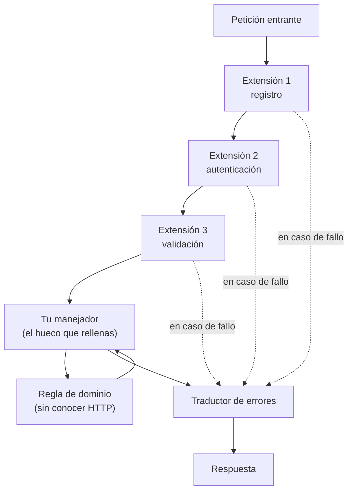

# Módulo 02 — Arquitectura de frameworks

> Todos los frameworks web resuelven el mismo problema: cómo dejar que tú
> escribas la parte específica sin escribir la parte repetida. Las diferencias
> están en el mecanismo de extensión, no en el propósito.

## Prerrequisitos y nivel

**Nivel:** intermedio. **Duración:** 14 horas. Requiere los módulos 00 y 01.

Debes poder describir de memoria el recorrido de una petición HTTP y haber
ejecutado la referencia sin framework del módulo 01.

## Objetivos observables

1. Explicar la inversión de control y distinguirla de la inyección de
   dependencias, que es una de sus formas [@fowler-injection].
2. Recorrer una petición y nombrar quién crea el manejador, quién valida, quién
   inyecta la colaboración y quién traduce el error, en cuatro ecosistemas.
3. Identificar el mecanismo de extensión de un framework dado: middleware,
   filtro, interceptor, plugin, módulo o suscripción a eventos.
4. Elegir el alcance (*scope*) correcto de una dependencia y explicar el fallo
   que produce elegirlo mal [@seemann-deursen-di].
5. Extraer una regla de dominio a una función probable sin arrancar el servidor
   [@martin-clean-architecture].

## Concepto independiente del framework

Inversión de control significa que **el marco decide cuándo se ejecuta tu
código**. La inyección de dependencias es una técnica concreta para suministrarle
a ese código sus colaboraciones desde fuera; son cosas distintas y confundirlas
lleva a discusiones estériles [@fowler-injection].



Los frameworks se diferencian en cómo se **registra** cada caja y en cuánto de
ese registro es explícito.

### Cuatro mecanismos de extensión

| Mecanismo | Cómo se registra | Qué controla | Riesgo característico |
| --- | --- | --- | --- |
| **Middleware / cadena** | Orden de inserción | Todo lo que pasa antes y después | El orden es invisible en el código de negocio |
| **Filtro / interceptor** | Declaración sobre un punto concreto | Un tipo de operación | Se dispersa la lógica transversal |
| **Plugin / módulo** | Registro con ciclo de vida propio | Un conjunto de capacidades | Dependencias implícitas entre módulos |
| **Evento / suscripción** | Publicación y suscripción [@hohpe-woolf-eip] | Reacción desacoplada | Difícil seguir el recorrido al depurar |

### Convención frente a configuración

Una convención elimina código a costa de hacer implícito lo que ocurre. La regla
práctica no es «convención buena, configuración mala», sino: **cuanto más
implícito, mejor debe ser el diagnóstico**. Un framework que adivina la ruta a
partir del nombre del archivo tiene que decirte, cuando falla, qué archivo
esperaba y por qué no lo encontró.

### Alcances de dependencia

| Alcance | Vive | Uso correcto | Fallo típico |
| --- | --- | --- | --- |
| Singleton | Todo el proceso | Configuración, pool de conexiones | Guardar en él datos de un usuario: se filtran entre peticiones |
| Por petición | Una petición | Contexto de la petición, transacción | Compartirlo con una tarea de fondo que sobrevive a la petición |
| Transitorio | Cada resolución | Objetos sin estado, baratos | Crear en él algo caro, por petición |

Inyectar un objeto de alcance corto dentro de uno de alcance largo es el fallo
más frecuente y el más difícil de reproducir: funciona con un usuario y falla en
producción con concurrencia [@seemann-deursen-di].

## Anatomía comparada

Recorrido de `POST /tasks` en cuatro ecosistemas del catálogo:

| Etapa | Express (Node.js) | NestJS (Node.js) | FastAPI (Python) | Spring Boot (Java) |
| --- | --- | --- | --- | --- |
| Registro de ruta | Llamada explícita `app.post` | Decorador sobre un método de clase | Decorador sobre una función | Anotación sobre un método |
| Creación del manejador | Es tu función; no se crea nada | El contenedor instancia el controlador | La función se llama directamente | El contenedor instancia el *bean* |
| Validación | La escribes o añades una biblioteca | Tubería de validación declarada | Derivada del tipo declarado | Anotaciones sobre el objeto de entrada |
| Inyección | Cierres o parámetros | Constructor, resuelto por el contenedor | Sistema de dependencias por parámetro | Constructor, resuelto por el contenedor |
| Traducción de errores | Middleware final de cuatro argumentos | Filtro de excepciones | Manejador de excepciones | Consejo de controlador |
| Punto de extensión transversal | Middleware | Interceptor / guardia | Dependencia y middleware | Aspecto / filtro |

**Lo que se repite:** en los cuatro hay un punto donde entra el mensaje, un punto
donde se valida, un punto donde se ejecuta tu regla y un punto donde el error se
convierte en respuesta. **Lo que cambia:** cuánto de eso escribes y cuánto se
deduce.

## Implementación mínima

Un contenedor de dependencias cabe en treinta líneas. Escribirlo una vez elimina
la sensación de magia.

```javascript
// contenedor.mjs — inversión de control con alcances, sin dependencias
export function crearContenedor() {
  const registros = new Map();

  function registrar(nombre, fabrica, alcance = "transitorio") {
    registros.set(nombre, { fabrica, alcance, instancia: undefined });
  }

  function resolver(nombre, ambitoDePeticion = new Map(), cadena = []) {
    // La cadena detecta ciclos: sin esto, un ciclo produce un
    // desbordamiento de pila en vez de un mensaje útil.
    if (cadena.includes(nombre)) throw new Error(`ciclo: ${[...cadena, nombre].join(" -> ")}`);
    const registro = registros.get(nombre);
    if (!registro) throw new Error(`dependencia no registrada: ${nombre}`);

    const crear = () => registro.fabrica((otro) => resolver(otro, ambitoDePeticion, [...cadena, nombre]));

    if (registro.alcance === "singleton") return (registro.instancia ??= crear());
    if (registro.alcance === "peticion") {
      if (!ambitoDePeticion.has(nombre)) ambitoDePeticion.set(nombre, crear());
      return ambitoDePeticion.get(nombre);
    }
    return crear();
  }

  return { registrar, resolver };
}
```

Uso, con el dominio ignorando por completo que existe HTTP:

```javascript
const contenedor = crearContenedor();
contenedor.registrar("reloj", () => ({ ahora: () => new Date() }), "singleton");
contenedor.registrar("repositorio", () => new Map(), "singleton");
contenedor.registrar(
  "crearTarea",
  (obtener) => {
    const repositorio = obtener("repositorio");
    const reloj = obtener("reloj");
    // Regla de dominio pura: recibe datos, devuelve datos o lanza.
    return ({ title }) => {
      if (!title?.trim()) throw Object.assign(new Error("title requerido"), { code: "TITLE_REQUIRED" });
      const tarea = { id: `t${repositorio.size + 1}`, title: title.trim(), done: false, createdAt: reloj.ahora() };
      repositorio.set(tarea.id, tarea);
      return tarea;
    };
  },
  "peticion",
);
```

El objeto devuelto por `crearTarea` no importa nada de HTTP, no conoce el
framework y puede probarse sin abrir un puerto. Eso es la regla de dependencia:
el detalle apunta a la política, nunca al revés [@martin-clean-architecture].

## Pruebas compartidas

```javascript
// contenedor.test.mjs — node --test contenedor.test.mjs
import assert from "node:assert/strict";
import { test } from "node:test";
import { crearContenedor } from "./contenedor.mjs";

test("el alcance singleton devuelve siempre la misma instancia", () => {
  const c = crearContenedor();
  c.registrar("x", () => ({}), "singleton");
  assert.equal(c.resolver("x"), c.resolver("x"));
});

test("el alcance por petición aísla entre peticiones distintas", () => {
  const c = crearContenedor();
  c.registrar("x", () => ({}), "peticion");
  const peticionA = new Map();
  const peticionB = new Map();
  assert.equal(c.resolver("x", peticionA), c.resolver("x", peticionA));
  assert.notEqual(c.resolver("x", peticionA), c.resolver("x", peticionB));
});

test("un ciclo de dependencias se informa, no desborda la pila", () => {
  const c = crearContenedor();
  c.registrar("a", (obtener) => obtener("b"));
  c.registrar("b", (obtener) => obtener("a"));
  assert.throws(() => c.resolver("a"), /ciclo: a -> b -> a/);
});

test("la regla de dominio se prueba sin servidor", () => {
  const c = crearContenedor();
  c.registrar("repositorio", () => new Map(), "singleton");
  c.registrar("reloj", () => ({ ahora: () => new Date(0) }), "singleton");
  // ...registro de crearTarea igual que arriba...
  // La ausencia de un servidor en esta prueba ES el criterio del módulo.
});
```

La tercera prueba es la que suele faltar en los proyectos reales: un ciclo sin
detectar aparece como un desbordamiento de pila en producción, sin decir dónde.

## Seguridad y accesibilidad

- **El orden de la cadena es una decisión de seguridad.** Si el registro de la
  petición se ejecuta antes de la autenticación, se registra tráfico no
  autenticado; si el análisis del cuerpo se ejecuta antes del límite de tamaño,
  el límite no protege nada.
- **Alcance y fuga de datos.** Un objeto de alcance singleton que guarda el
  usuario actual filtra ese usuario a la siguiente petición. Es una fuga de
  datos personales, no un fallo de rendimiento [@seemann-deursen-di].
- **Errores traducidos, no propagados.** El traductor de errores es el único
  lugar donde se decide qué ve el cliente. Si cada manejador decide por su
  cuenta, tarde o temprano uno filtra una traza.
- **Accesibilidad.** La validación debe devolver **qué campo** falló y **por
  qué**, porque una interfaz accesible necesita asociar el mensaje al control
  concreto. Un framework que solo dice «inválido» impide construir ese vínculo.

## Errores frecuentes y diagnóstico

| Síntoma | Causa | Diagnóstico |
| --- | --- | --- |
| Funciona en desarrollo y falla con carga | Alcance mal elegido, estado compartido | Revisa qué objetos son singleton y qué guardan dentro |
| Un cambio de orden en el arranque rompe la autenticación | Cadena de middleware con dependencias de orden implícitas | Escribe el orden esperado como prueba |
| Desbordamiento de pila al arrancar | Ciclo de dependencias | Añade detección de ciclos al contenedor |
| No se puede probar la regla sin levantar el servidor | El dominio depende del transporte | Extrae la regla a una función pura [@martin-clean-architecture] |
| La misma lógica transversal aparece en veinte sitios | No se usó el mecanismo de extensión del framework | Identifica cuál ofrece: middleware, filtro o interceptor |
| Nadie sabe qué ocurre entre la petición y el manejador | Convención sin diagnóstico | Activa el registro del framework y dibuja el recorrido real |
| Un evento se dispara y nadie sabe quién responde | Publicación y suscripción sin trazabilidad [@hohpe-woolf-eip] | Correlaciona con un identificador que atraviese los suscriptores |

## Comprobación de recuerdo

1. ¿Inversión de control e inyección de dependencias son lo mismo? Explica.
2. Nombra los cuatro mecanismos de extensión y un riesgo de cada uno.
3. ¿Qué fallo produce guardar el usuario actual en un objeto singleton?
4. ¿Por qué el traductor de errores debe estar en un único punto?
5. ¿Cuál es la prueba de que tu dominio no depende del framework?

**Repaso espaciado.** Repite estas preguntas al terminar el módulo 05 y otra vez
al preparar el módulo 10.

## Reto de transferencia

Toma la regla `crearTarea` y hazla funcionar **sin cambiar una línea de la
función** bajo dos adaptadores distintos:

1. el servidor sin framework del módulo 01;
2. un segundo adaptador de tu elección (otro framework, una función de línea de
   comandos o un consumidor de mensajes [@hohpe-woolf-eip]).

Entrega: el mismo archivo de dominio, dos adaptadores, y una prueba del dominio
que no importe ninguno de los dos. Si tuviste que tocar el dominio, el
acoplamiento estaba ahí y no lo habías visto.

Documenta con `templates/ADR_TEMPLATE.md` qué mecanismo de extensión elegiste en
cada adaptador y qué patrón clásico corresponde: fábrica, decorador, estrategia u
observador [@gof-design-patterns].

## Criterios de evaluación

| Criterio | Insuficiente | Suficiente | Sólido | Ejemplar |
| --- | --- | --- | --- | --- |
| Inversión de control | Cree que es «usar un framework» | La define correctamente | Distingue mecanismo y alcance | Elige el mecanismo justificando el compromiso |
| Independencia del dominio | El dominio importa el framework | Lo separa parcialmente | Regla pura y probada sin servidor | Dos adaptadores sobre el mismo dominio |
| Diagnóstico | No sabe qué pasa en la cadena | Lee el registro | Dibuja el recorrido real | Convierte el orden en una prueba |
| Alcances | No los conoce | Los nombra | Elige el correcto | Detecta una fuga por alcance en código ajeno |

## Fuentes

- [@fowler-injection] Fowler, Martin. *Inversion of Control Containers and the Dependency Injection pattern*, 2004 — <https://martinfowler.com/articles/injection.html>
- [@seemann-deursen-di] Seemann, Mark; van Deursen, Steven. *Dependency Injection Principles, Practices, and Patterns*. Manning Publications, 2019. ISBN 9781617294730 — <https://openlibrary.org/isbn/9781617294730>
- [@gof-design-patterns] Gamma, Erich; Helm, Richard; Johnson, Ralph; Vlissides, John. *Design Patterns: Elements of Reusable Object-Oriented Software*. Addison-Wesley Professional, 1994. ISBN 9780201633610 — <https://openlibrary.org/isbn/9780201633610>
- [@martin-clean-architecture] Martin, Robert C. *Clean Architecture*. Pearson, 2017. ISBN 9780134494166 — <https://openlibrary.org/isbn/9780134494166>
- [@hohpe-woolf-eip] Hohpe, Gregor; Woolf, Bobby. *Enterprise Integration Patterns*. Addison-Wesley, 2003. ISBN 9780321200686 — <https://openlibrary.org/isbn/9780321200686>
