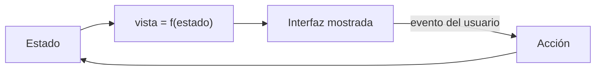

# Módulo 03 — Frontend, componentes y estado

> Un componente es una función de estado a interfaz. Todo lo demás —sintaxis,
> compilador, sistema de reactividad— es la estrategia de cada ecosistema para
> volver a ejecutar esa función cuando el estado cambia.

## Prerrequisitos y nivel

**Nivel:** intermedio. **Duración:** 18 horas. Requiere los módulos 00 a 02.

## Objetivos observables

1. Clasificar un dato de la interfaz en estado de servidor, estado de interfaz,
   estado derivado o estado de formulario, y justificar dónde debe vivir.
2. Construir un componente accesible por teclado y con lector de pantalla
   siguiendo un patrón publicado [@w3c-aria-apg].
3. Comprobar tres criterios de WCAG 2.2 sobre una interfaz propia
   [@w3c-wcag22].
4. Explicar la diferencia entre reactividad por comparación de árbol virtual,
   por señales y por compilación, y qué consecuencia observable tiene cada una.
5. Detectar y eliminar estado derivado duplicado.

## Concepto independiente del framework



El ciclo es idéntico en todos los ecosistemas. Lo que cambia es **cómo se entera
el sistema de que el estado cambió**:

| Estrategia | Cómo detecta el cambio | Consecuencia observable |
| --- | --- | --- |
| Árbol virtual y comparación | Se vuelve a ejecutar la función y se compara el resultado | El coste crece con el tamaño del árbol; hay que dar claves estables a las listas |
| Señales / reactividad fina | La lectura de un valor se registra; al escribir se avisa a sus lectores | Solo se actualiza lo que leyó ese valor; el coste crece con las dependencias, no con el árbol |
| Compilación | El compilador conoce las dependencias en tiempo de construcción | Menos trabajo en ejecución; más dependencia de la fase de construcción |

Ninguna es superior en abstracto. La pregunta útil es: ¿qué se paga —trabajo en
ejecución, tamaño del paquete o dependencia del compilador— y qué te sobra en tu
producto?

### Cuatro clases de estado

| Clase | Ejemplo | Dónde debe vivir | Error típico |
| --- | --- | --- | --- |
| **De servidor** | La lista de tareas | En una caché con revalidación; el servidor es la verdad | Copiarlo a un almacén global y desincronizarlo |
| **De interfaz** | Si el menú está abierto | Lo más cerca posible de quien lo usa | Elevarlo a un almacén global «por si acaso» |
| **Derivado** | Número de tareas pendientes | No se guarda: se calcula | Guardarlo y olvidarse de actualizarlo |
| **De formulario** | Lo que el usuario está escribiendo | En el formulario, hasta enviarlo | Sincronizarlo con el servidor en cada tecla |

La regla que elimina la mayoría de los fallos: **si puede calcularse, no se
guarda**. Estado derivado duplicado es la causa habitual de interfaces que
muestran dos números distintos para lo mismo [@osmani-js-design-patterns].

## Anatomía comparada

El mismo contador con etiqueta accesible, en cuatro enfoques:

| Aspecto | Biblioteca de interfaz (React) | Framework con compilador (Svelte) | Framework completo (Angular) | Sin framework (plataforma) |
| --- | --- | --- | --- | --- |
| Declaración del estado | Llamada a un enganche dentro del componente | Declaración de variable que el compilador observa | Propiedad de clase con detección de cambios | Variable y actualización manual del DOM |
| Nueva ejecución | Toda la función del componente | Solo las expresiones dependientes | Zona de detección o señales | Lo que tú escribas |
| Plantilla | Expresión en el mismo lenguaje | Lenguaje de plantilla compilado | Plantilla con directivas | HTML directo [@whatwg-html] |
| Coste de aprendizaje | Reglas de los enganches | Reglas del compilador | Módulos, inyección y plantillas | Ninguno del framework; todo del DOM |
| Diagnóstico | Herramientas del ecosistema | Ver el código generado | Herramientas del ecosistema | Depurador del navegador [@mdn-web-docs] |

La comparación solo es honesta si los cuatro implementan **el mismo** requisito
de accesibilidad y **el mismo** comportamiento ante error de red.

## Implementación mínima

Un componente accesible sin ningún framework, para tener el patrón de medida:

```html
<!-- contador.html — sirve de referencia de accesibilidad para las cuatro versiones -->
<div class="contador">
  <h2 id="titulo-contador">Tareas pendientes</h2>
  <!-- aria-live avisa al lector de pantalla del cambio sin mover el foco. -->
  <output id="valor" aria-live="polite" aria-labelledby="titulo-contador">0</output>
  <button type="button" id="menos" aria-describedby="titulo-contador">Quitar una</button>
  <button type="button" id="mas" aria-describedby="titulo-contador">Añadir una</button>
</div>

<script type="module">
  // Único origen de verdad. Lo derivado se calcula al pintar, no se almacena.
  let pendientes = 0;

  const valor = document.getElementById("valor");
  const pintar = () => {
    valor.textContent = String(pendientes);
    document.getElementById("menos").disabled = pendientes === 0;
  };

  document.getElementById("mas").addEventListener("click", () => {
    pendientes += 1;
    pintar();
  });
  document.getElementById("menos").addEventListener("click", () => {
    pendientes = Math.max(0, pendientes - 1);
    pintar();
  });

  pintar();
</script>
```

Tres decisiones que un framework no toma por ti:

1. `<output>` con `aria-live="polite"` hace que el cambio se anuncie sin robar el
   foco; un `<div>` no anuncia nada [@w3c-aria-apg].
2. Deshabilitar «Quitar una» en cero **muestra el límite** en vez de castigar el
   error: es una restricción visible, no un mensaje después del fallo
   [@norman-design-everyday-things].
3. `type="button"` evita que dentro de un formulario el botón lo envíe
   [@whatwg-html].

## Pruebas compartidas

Las mismas afirmaciones deben cumplirse en las cuatro implementaciones:

1. **Teclado.** Se llega a todos los controles con `Tab`, en orden visual, y se
   activan con `Enter` y `Espacio`.
2. **Nombre accesible.** Cada control tiene un nombre que un lector de pantalla
   anuncia y que describe la acción, no el icono [@kalbag-accessibility-for-everyone].
3. **Anuncio del cambio.** Al cambiar el valor, la región activa lo comunica.
4. **Foco visible.** El indicador de foco es perceptible y cumple el contraste
   exigido [@w3c-wcag22].
5. **Estado derivado.** No existe ninguna variable que almacene un valor que
   pudiera calcularse; se comprueba leyendo el código.
6. **Fallo de red.** Ante un error al cargar, la interfaz lo comunica y ofrece
   reintentar; no se queda en blanco.

## Seguridad y accesibilidad

- **Inyección en la interfaz.** Insertar texto de un tercero como HTML es la vía
  clásica de secuencias de comandos entre sitios. Los frameworks escapan por
  omisión; las escotillas que insertan HTML crudo desactivan esa protección y
  deben tratarse como código privilegiado [@mdn-web-docs].
- **Objetivos de tamaño y ayuda de entrada.** WCAG 2.2 añadió criterios sobre
  tamaño mínimo del objetivo y sobre no exigir al usuario recordar información
  entre pasos [@w3c-wcag22]. Revísalos: son de los que más se incumplen.
- **Componentes compuestos.** Un desplegable, un diálogo o una pestaña tienen un
  comportamiento de teclado esperado y publicado. Reinventarlo produce
  componentes que parecen correctos y no lo son [@pickering-inclusive-components].
- **La accesibilidad no es una capa final.** Añadir atributos al terminar cuesta
  más y funciona peor que elegir el elemento correcto desde el principio
  [@kalbag-accessibility-for-everyone].

## Errores frecuentes y diagnóstico

| Síntoma | Causa | Diagnóstico |
| --- | --- | --- |
| Dos partes de la interfaz muestran cifras distintas de lo mismo | Estado derivado duplicado | Busca variables que podrían ser un cálculo |
| Las listas se reordenan mal al actualizar | Claves inestables (índice como clave) | Usa un identificador estable del dato |
| Todo se vuelve a renderizar al escribir una letra | Estado de formulario elevado demasiado | Baja el estado al componente que lo usa |
| El lector de pantalla no anuncia el cambio | Sin región activa | Añade la región y comprueba con un lector real [@w3c-aria-apg] |
| El menú se abre con ratón pero no con teclado | Se escuchó solo el evento de puntero | Prueba la interfaz sin ratón, de principio a fin |
| El botón dentro del formulario recarga la página | Falta `type="button"` [@whatwg-html] | Revisa el tipo por omisión de `<button>` |
| «Lo hacemos accesible al final» | Accesibilidad tratada como capa | Conviértela en criterio de aceptación desde la primera prueba |

## Comprobación de recuerdo

1. Nombra las cuatro clases de estado y dónde debe vivir cada una.
2. ¿Qué regla elimina la mayoría de las inconsistencias de la interfaz?
3. ¿Qué consecuencia observable distingue la reactividad fina de la comparación
   de árbol?
4. ¿Por qué un `<div>` con texto que cambia no sirve como región activa?
5. Da un ejemplo de restricción visible frente a mensaje de error posterior.

**Repaso espaciado.** Repite al terminar el módulo 04 y antes del módulo 08.

## Reto de transferencia

Implementa **el mismo** panel de tareas en dos ecosistemas distintos, cumpliendo
las seis pruebas compartidas de arriba, y entrega:

1. una tabla que clasifique cada dato del panel en las cuatro clases de estado;
2. la lista de estado derivado que **decidiste no almacenar**;
3. el resultado de recorrer la interfaz solo con teclado, escrito paso a paso;
4. el patrón de accesibilidad seguido para el componente compuesto que uses
   [@w3c-aria-apg];
5. una diferencia de comportamiento entre los dos ecosistemas que **no** puedas
   eliminar, y por qué.

El punto 5 es el más valioso: las diferencias irreductibles son la información
que una comparación honesta produce.

## Criterios de evaluación

| Criterio | Insuficiente | Suficiente | Sólido | Ejemplar |
| --- | --- | --- | --- | --- |
| Modelo de estado | Todo en un almacén global | Separa servidor e interfaz | Clasifica los cuatro tipos y justifica | Elimina estado derivado y lo demuestra |
| Accesibilidad | No se considera | Etiquetas presentes | Teclado, nombre, foco y anuncio verificados | Patrón publicado aplicado y probado con lector |
| Comparación | Compara sintaxis | Compara comportamiento | Compara con requisitos idénticos | Documenta las diferencias irreductibles |
| Diagnóstico | Prueba y error | Usa herramientas del ecosistema | Localiza la causa del re-renderizado | Reduce el trabajo midiendo antes y después |

## Fuentes

- [@osmani-js-design-patterns] Osmani, Addy. *Learning JavaScript Design Patterns*, 2.ª ed. O'Reilly Media, 2023. ISBN 9781098139872 — <https://openlibrary.org/isbn/9781098139872>
- [@pickering-inclusive-components] Pickering, Heydon. *Inclusive Components*. Smashing Magazine, 2019. ISBN 9783945749821 — <https://openlibrary.org/isbn/9783945749821>
- [@kalbag-accessibility-for-everyone] Kalbag, Laura. *Accessibility for Everyone*. A Book Apart, 2017. ISBN 9781937557614 — <https://openlibrary.org/isbn/9781937557614>
- [@norman-design-everyday-things] Norman, Donald A. *The Design of Everyday Things*, ed. revisada. Basic Books, 2013. ISBN 9780465050659 — <https://openlibrary.org/isbn/9780465050659>
- [@w3c-wcag22] Web Content Accessibility Guidelines (WCAG) 2.2, W3C, 2023 — <https://www.w3.org/TR/WCAG22/>
- [@w3c-aria-apg] ARIA Authoring Practices Guide, W3C — <https://www.w3.org/WAI/ARIA/apg/>
- [@whatwg-html] HTML Standard, WHATWG — <https://html.spec.whatwg.org/multipage/>
- [@mdn-web-docs] MDN Web Docs, Mozilla — <https://developer.mozilla.org/en-US/docs/Web>
