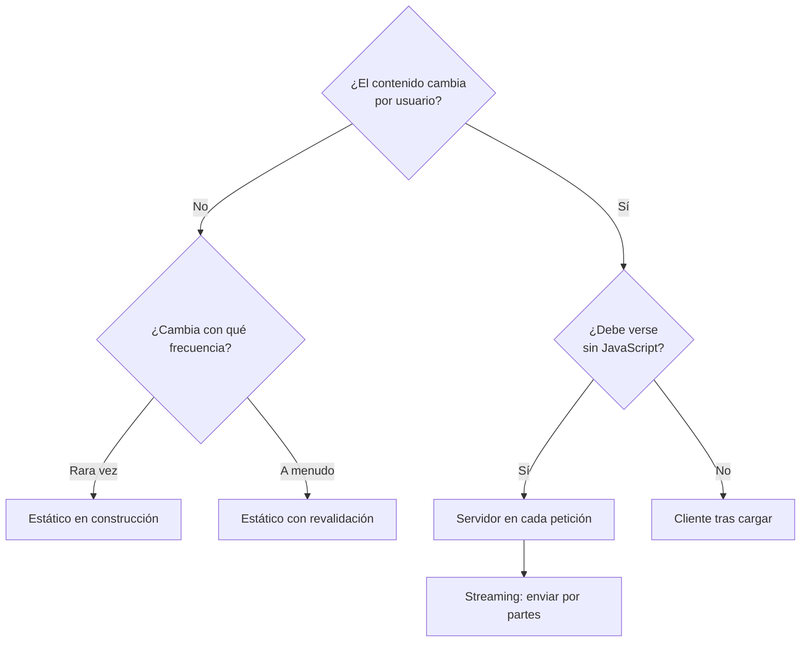

# Módulo 04 — Full stack y renderizado

> «Renderizar en el servidor» no es una mejora: es mover trabajo de sitio. El
> módulo enseña a decidir qué trabajo se mueve, con qué evidencia y a qué coste.

## Prerrequisitos y nivel

**Nivel:** intermedio. **Duración:** 14 horas. Requiere los módulos 01 y 03.

## Objetivos observables

1. Describir las cinco estrategias de renderizado y el momento exacto en que
   cada una produce el HTML [@webdev-rendering].
2. Elegir una estrategia para un caso dado y defenderla con los atributos de
   calidad afectados, no con una preferencia [@richards-ford-fundamentals].
3. Medir el efecto de la elección con métricas centradas en el usuario
   [@webdev-vitals].
4. Declarar la política de caché de una respuesta y explicar quién la aplica
   [@rfc9111].
5. Identificar qué se rompe al mover código de cliente a servidor: secretos,
   objetos globales del navegador y suposiciones de sesión.

## Concepto independiente del framework

Tres preguntas determinan la estrategia, y ninguna menciona un framework:

1. **¿Cuándo existe el HTML?** En construcción, en la petición o en el navegador.
2. **¿Quién ejecuta el código?** Un servidor que controlas, una red de
   distribución cerca del usuario, o el dispositivo del usuario.
3. **¿Qué caduca el contenido?** El tiempo, un evento o nada.



| Estrategia | El HTML existe | Coste principal | Cuándo encaja |
| --- | --- | --- | --- |
| Cliente (CSR) | Tras descargar y ejecutar el guion | Primera pintura tardía; dependencia de JavaScript | Aplicaciones tras autenticación, con interacción intensa |
| Servidor (SSR) | En cada petición | Trabajo por petición; servidor siempre disponible | Contenido personalizado que debe verse pronto |
| Estático (SSG) | En la construcción | Reconstruir para cambiar | Contenido igual para todos y estable |
| Estático con revalidación | En construcción, se renueva | Ventana de contenido obsoleto | Catálogos que cambian a ritmo conocido |
| Streaming | Por partes, según se resuelve | Complejidad de error parcial | Páginas con una parte rápida y otra lenta |

La decisión se toma por **contenido**, no por aplicación: una misma aplicación
suele mezclar cuatro de las cinco.

### Hidratación: el coste que se olvida

Renderizar en el servidor entrega píxeles antes; **no** entrega interactividad
antes. El navegador todavía debe descargar y ejecutar el código que conecta los
manejadores. Ese intervalo —se ve pero no responde— es el fallo característico
del renderizado en servidor mal medido [@webdev-rendering].

## Anatomía comparada

Mismo contenido, cuatro decisiones:

| Página del producto | Estrategia adecuada | Caché declarada [@rfc9111] | Motivo |
| --- | --- | --- | --- |
| Portada de marketing | Estático | `public, max-age=3600, stale-while-revalidate=86400` | Igual para todos, cambia poco |
| Listado del catálogo | Estático con revalidación | `public, s-maxage=60` | Cambia a ritmo conocido; el intermediario lo absorbe |
| Panel del usuario | Servidor por petición | `private, no-store` | Personalizado; no debe almacenarse en intermediarios |
| Editor de tareas | Cliente | `no-cache` para los datos | Interacción intensa tras autenticación |

Declarar `private, no-store` en respuestas personalizadas no es una optimización:
es lo que impide que un intermediario compartido sirva el panel de una persona a
otra.

## Implementación mínima

Las tres estrategias, sin framework, sobre el mismo dato:

```javascript
// renderizado.mjs — node renderizado.mjs
const tareas = [
  { id: "t1", title: "Leer RFC 9110", done: true },
  { id: "t2", title: "Medir la hidratación", done: false },
];

// El escape es obligatorio: cualquier texto que venga de fuera puede contener
// marcado. Sin esto, la plantilla es una inyección esperando a ocurrir.
const escapar = (texto) =>
  String(texto).replace(/[&<>"']/g, (c) => ({ "&": "&amp;", "<": "&lt;", ">": "&gt;", '"': "&quot;", "'": "&#39;" })[c]);

const plantilla = (lista) => `<!doctype html>
<html lang="es"><head><meta charset="utf-8"><title>Tareas</title></head>
<body>
  <h1>Tareas</h1>
  <ul>${lista.map((t) => `<li>${t.done ? "✔" : "○"} ${escapar(t.title)}</li>`).join("")}</ul>
</body></html>`;

// 1. Estático: el HTML se produce ahora y se guarda en disco.
import fs from "node:fs";
fs.writeFileSync("estatico.html", plantilla(tareas));

// 2. Servidor: el HTML se produce al recibir la petición.
import http from "node:http";
http
  .createServer((req, res) => {
    res.writeHead(200, { "content-type": "text/html; charset=utf-8", "cache-control": "private, no-store" });
    res.end(plantilla(tareas));
  })
  .listen(3000);

// 3. Cliente: se envía el esqueleto y el navegador pide los datos.
//    El contenido no existe hasta que el guion se descarga y ejecuta.
```

Ejecuta las tres y compara con las herramientas de red del navegador: qué llega
en la primera respuesta y cuándo la página responde a un clic [@mdn-web-docs].

## Pruebas compartidas

Se aplican a cualquier estrategia; una comparación sin ellas no es comparable.

1. **Sin JavaScript.** Deshabilitado el guion, ¿qué se ve? La respuesta esperada
   depende de la estrategia, pero debe estar decidida y documentada.
2. **Contenido en la primera respuesta.** Comprobar con `curl` que el HTML de la
   respuesta inicial contiene —o no— el contenido, según lo decidido.
3. **Caché declarada.** Cada respuesta lleva `Cache-Control` explícito; ninguna
   respuesta personalizada es almacenable en intermediarios [@rfc9111].
4. **Interactividad.** Medir el tiempo entre la primera pintura y el momento en
   que un clic produce efecto.
5. **Red lenta.** Repetir la medición con limitación de red; la diferencia entre
   estrategias solo se ve fuera de una conexión rápida [@grigorik-hpbn].
6. **Mismo entorno.** Las dos implementaciones comparadas se miden en modo de
   producción, con la misma versión de runtime y la misma caché.

## Seguridad y accesibilidad

- **Secretos que cruzan el límite.** Al mover código al servidor es fácil dejar
  una clave en un módulo que también se empaqueta para el cliente. Comprueba el
  paquete resultante: si la clave está en el archivo servido, está publicada.
- **Escape en plantillas de servidor.** El renderizado en servidor construye HTML
  concatenando texto. Todo dato externo debe escaparse; la protección por omisión
  del cliente no está ahí [@mdn-web-docs].
- **Caché y datos personales.** Una respuesta personalizada sin `private` puede
  quedar almacenada en un intermediario compartido y servirse a otra persona
  [@rfc9111].
- **Accesibilidad del contenido diferido.** Cuando una parte llega por streaming,
  su aparición debe anunciarse; si no, un lector de pantalla no se entera de que
  la página cambió. Los estados de carga necesitan texto, no solo animación.
- **Sin JavaScript.** Elegir el renderizado en cliente para contenido público
  excluye a quien no puede ejecutarlo. Es una decisión legítima solo si es
  consciente.

## Errores frecuentes y diagnóstico

| Síntoma | Causa | Diagnóstico |
| --- | --- | --- |
| Se ve rápido pero no responde | Coste de hidratación ignorado | Mide la interactividad, no solo la pintura [@webdev-vitals] |
| Una persona ve el panel de otra | Respuesta personalizada almacenable | Revisa `Cache-Control`: debe ser `private, no-store` |
| El contenido no aparece en el HTML inicial | Estrategia de cliente donde se esperaba servidor | `curl` a la URL y busca el texto en la respuesta |
| Cambios que no llegan a los usuarios | Revalidación mal configurada | Comprueba `s-maxage` y la invalidación del intermediario |
| Un secreto aparece en el paquete del cliente | Módulo compartido entre ambos lados | Inspecciona el archivo servido, no el código fuente |
| «Servidor siempre es más rápido» | Métrica única, entorno distinto | Repite con red limitada y ambos en modo producción [@grigorik-hpbn] |
| Error en una parte y página en blanco | Streaming sin control de error parcial | Define qué se muestra si un fragmento falla |

## Comprobación de recuerdo

1. ¿Cuándo existe el HTML en cada una de las cinco estrategias?
2. ¿Qué entrega el renderizado en servidor y qué **no** entrega?
3. ¿Qué directiva impide que un intermediario guarde una respuesta personal?
4. ¿Por qué una comparación medida en red rápida puede ser engañosa?
5. Da un caso donde el renderizado en cliente sea la elección correcta.

**Repaso espaciado.** Repite al terminar el módulo 08 y antes del módulo 11.

## Reto de transferencia

Toma una aplicación con cuatro páginas distintas y produce una **tabla de
decisión** que, para cada página, declare: estrategia, política de caché, qué se
ve sin JavaScript, y el atributo de calidad que la decisión prioriza
[@richards-ford-fundamentals].

Después implementa **dos** de las cuatro páginas con estrategias diferentes y
mide las seis pruebas compartidas en ambas, en red limitada. Entrega los números,
no la impresión.

## Criterios de evaluación

| Criterio | Insuficiente | Suficiente | Sólido | Ejemplar |
| --- | --- | --- | --- | --- |
| Decisión | «Usamos SSR porque es mejor» | Elige según el contenido | Justifica con atributos de calidad | Mezcla estrategias por página con criterio explícito |
| Medición | No mide | Mide la primera pintura | Mide interactividad y red limitada | Compara en igualdad de entorno y publica el protocolo |
| Caché | Sin declarar | Declarada en algunas | Declarada en todas y coherente | Verifica el comportamiento del intermediario |
| Seguridad | Secretos sin revisar | Revisa el código fuente | Inspecciona el paquete servido | Automatiza la comprobación en la construcción |

## Fuentes

- [@webdev-rendering] *Rendering on the Web*, Google — web.dev — <https://web.dev/articles/rendering-on-the-web>
- [@webdev-vitals] *Web Vitals*, Google — web.dev — <https://web.dev/articles/vitals>
- [@grigorik-hpbn] Grigorik, Ilya. *High Performance Browser Networking*. O'Reilly Media, 2013. ISBN 9781449344764 — <https://openlibrary.org/isbn/9781449344764>
- [@rfc9111] RFC 9111 — HTTP Caching, IETF, 2022 — <https://www.rfc-editor.org/rfc/rfc9111>
- [@richards-ford-fundamentals] Richards, Mark; Ford, Neal. *Fundamentals of Software Architecture*. O'Reilly Media, 2020. ISBN 9781492043454 — <https://openlibrary.org/isbn/9781492043454>
- [@mdn-web-docs] MDN Web Docs, Mozilla — <https://developer.mozilla.org/en-US/docs/Web>
