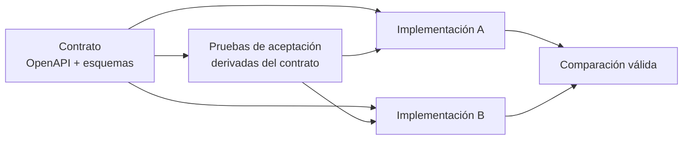

# Módulo 05 — Backend y API

> Este es el módulo donde el mismo contrato se implementa en dos ecosistemas y
> se comparan con las mismas pruebas. Todo lo anterior existía para que esta
> comparación signifique algo.

## Prerrequisitos y nivel

**Nivel:** intermedio. **Duración:** 20 horas. Requiere los módulos 01 y 02.

## Objetivos observables

1. Escribir un contrato completo en OpenAPI antes de implementar
   [@openapi-spec].
2. Validar la entrada contra un esquema y traducir el fallo a una respuesta
   normalizada [@json-schema], [@rfc9457].
3. Implementar TaskFlow en dos ecosistemas y pasar las **mismas** pruebas de
   aceptación.
4. Diseñar la evolución del contrato sin romper a los clientes existentes
   [@geewax-api-design-patterns].
5. Justificar cuándo un servicio debe separarse y cuándo no
   [@fowler-microservice-tradeoffs].

## Concepto independiente del framework

Una API es un **contrato**: un conjunto de promesas sobre qué mensajes acepta,
qué mensajes devuelve y qué garantiza sobre el estado. El framework es el medio
para cumplirlo; la promesa existe antes que él.



Si las pruebas se derivan de la implementación en lugar del contrato, cada
implementación aprueba su propio examen y la comparación no dice nada. El
contrato incluye también cómo se descubren y relacionan los recursos: una API
que obliga al cliente a construir URL a mano acopla al cliente con la estructura
interna del servidor [@richardson-amundsen-restful].

### ¿Un servicio o varios?

Separar un servicio compra independencia de despliegue y paga con latencia,
fallos parciales, consistencia eventual y una superficie de operación mucho
mayor [@newman-building-microservices]. La pregunta previa no es «¿cómo lo
dividimos?» sino «¿qué problema tenemos hoy que la división resuelve y que un
módulo bien delimitado no resuelve?» [@fowler-microservice-tradeoffs].

### Las cuatro capas que todo backend tiene

| Capa | Responsabilidad | Depende de | No debe conocer |
| --- | --- | --- | --- |
| **Transporte** | Traducir mensajes HTTP a llamadas | El framework | Reglas de negocio |
| **Aplicación** | Orquestar el caso de uso, la transacción | El dominio | El framework HTTP |
| **Dominio** | Las reglas que serían ciertas en papel | Nada | Todo lo demás |
| **Infraestructura** | Persistencia, mensajería, terceros | Interfaces del dominio | Los casos de uso |

En un servicio pequeño estas capas pueden ser cuatro carpetas o cuatro funciones.
Lo que no puede es faltar la **dirección** de las dependencias: hacia el dominio,
nunca desde él.

### Evolución sin ruptura

| Cambio | ¿Rompe? | Cómo se hace |
| --- | --- | --- |
| Añadir un campo opcional a la respuesta | No | Los clientes ignoran lo que no conocen |
| Añadir un campo obligatorio a la petición | **Sí** | Añadir como opcional, migrar, luego exigir |
| Cambiar el tipo de un campo | **Sí** | Campo nuevo, ambos convivan, retirar el antiguo con aviso |
| Quitar un campo de la respuesta | **Sí** | Marcar obsoleto, medir su uso, retirar tras un plazo publicado |
| Cambiar un código de error | **Sí** | Los códigos son parte del contrato [@rfc9457] |
| Añadir un recurso nuevo | No | Nadie dependía de él |

La regla operativa: **puedes añadir lo opcional y no puedes quitar lo prometido**
[@geewax-api-design-patterns].

## Anatomía comparada

El mismo `POST /tasks` en los laboratorios del repositorio:

| Aspecto | Express | FastAPI | Spring Boot | ASP.NET Core |
| --- | --- | --- | --- | --- |
| Definición del contrato | Documento aparte, verificado en pruebas | Derivado de los tipos declarados | Anotaciones más documento | Anotaciones más documento |
| Validación de entrada | Explícita o con biblioteca | Automática desde el tipo | Anotaciones sobre el objeto | Anotaciones y enlace del modelo |
| Forma del error | La define quien escribe | Estructura del framework, adaptable | Consejo de controlador | Filtro y `ProblemDetails` |
| Idempotencia | Implementada a mano | Implementada a mano | Implementada a mano | Implementada a mano |
| Código propio para el contrato | Más | Menos | Medio | Medio |
| Dónde vive el riesgo | En lo que olvidas escribir | En lo que asume el framework | En la configuración | En la configuración |

La última fila resume el compromiso del módulo entero: **lo explícito falla por
omisión y lo implícito falla por sorpresa**. Ninguna de las dos es gratis.

## Implementación mínima

Extracto literal del contrato canónico del repositorio. Lo verifica
`scripts/verify-contract.mjs`: si el contrato cambia y esta lección no, la
validación falla. Una lección que cita mal el contrato es peor que una que no lo
cita.

<!-- extracto-verificado: contracts/taskflow/openapi.yaml -->
```yaml
    post:
      operationId: createTask
      summary: Crear una tarea
      parameters:
        - $ref: "#/components/parameters/IdempotencyKey"
      requestBody:
        required: true
        content:
          application/json:
            schema: {$ref: "#/components/schemas/CreateTask"}
      responses:
        "201":
          description: Tarea creada
          headers:
            Location:
              required: true
              description: Ruta del recurso creado
```

La clave de idempotencia es **obligatoria** en este contrato, no opcional. Es una
decisión discutible y por eso está documentada: obliga al cliente a pensar en el
reintento desde el primer día, a cambio de rechazar peticiones que en otra API
serían válidas. Un contrato que la hiciera opcional tendría que explicar qué pasa
con los duplicados, y casi ninguno lo hace.

### El sobre de error, una sola vez

```javascript
// problema.mjs — el ÚNICO punto que construye respuestas de error
const CATALOGO = {
  IDEMPOTENCY_KEY_REQUIRED: { status: 400, title: "Idempotency key required" },
  MALFORMED_JSON: { status: 400, title: "Malformed JSON" },
  TASK_NOT_FOUND: { status: 404, title: "Task not found" },
  VALIDATION_ERROR: { status: 422, title: "Validation error" },
};

export function problema(code, { detail, instance, errors } = {}) {
  const { status, title } = CATALOGO[code];
  // RFC 9457: type, title y status son obligatorios. `code` y `errors` son
  // miembros de extensión, que la norma permite y el contrato documenta.
  const cuerpo = { type: `https://example.org/problems/${code.toLowerCase().replace(/_/g, "-")}`, title, status, code };
  if (detail) cuerpo.detail = detail;
  if (instance) cuerpo.instance = instance;
  if (errors?.length) cuerpo.errors = errors;
  return { status, headers: { "content-type": "application/problem+json" }, cuerpo };
}
```

Si cada rama del código construyera su propio error, tarde o temprano una
filtraría una traza o cambiaría el formato sin que nadie lo notara. El catálogo
cerrado hace además que añadir un código sea un acto deliberado: los códigos son
parte del contrato [@rfc9457], y cambiarlos rompe a los clientes.

### Validación que nombra el campo

```javascript
// validar.mjs — misma regla que la referencia del módulo 01
const TITLE_MAX = 120;

export function validarCreateTask(entrada) {
  const errores = [];
  if (typeof entrada !== "object" || entrada === null || Array.isArray(entrada)) {
    return [{ field: "", code: "BODY_NOT_OBJECT", detail: "The body must be a JSON object" }];
  }
  const { title } = entrada;
  if (typeof title !== "string") {
    errores.push({ field: "title", code: "TITLE_REQUIRED", detail: "title is required and must be a string" });
  } else if (title.trim().length === 0) {
    errores.push({ field: "title", code: "TITLE_EMPTY", detail: "title must not be blank" });
  } else if (title.trim().length > TITLE_MAX) {
    errores.push({ field: "title", code: "TITLE_TOO_LONG", detail: `title must not exceed ${TITLE_MAX} characters` });
  }
  return errores;
}
```

El error lleva el campo culpable. Sin esa granularidad, la interfaz accesible del
módulo 03 no puede asociar el mensaje al control correspondiente: el error por
campo es un requisito de accesibilidad, no un lujo del backend [@json-schema].

## Pruebas compartidas

No son una lista de buenas intenciones: son **20 casos ejecutables** en
[`contracts/taskflow/acceptance.test.mjs`](../contracts/taskflow/acceptance.test.mjs),
descritos en [`ACCEPTANCE.md`](../contracts/taskflow/ACCEPTANCE.md). Solo hablan
HTTP, así que se lanzan sin adaptador contra cualquier implementación:

```bash
node scripts/run-acceptance.mjs reference-node   # referencia sin framework
node scripts/run-acceptance.mjs express          # el mismo examen
node scripts/run-acceptance.mjs fastapi
node scripts/run-acceptance.mjs --url http://donde-sea:8080
```

Tres de esos casos concentran lo que el módulo enseña:

```javascript
test("repetir la misma clave de idempotencia no crea una segunda tarea", async () => {
  const key = clave();
  const primera = await crear("Una sola vez", { key });
  const segunda = await crear("Una sola vez", { key });

  assert.equal(primera.status, 201);
  assert.equal(segunda.status, 200, "la repetición se reconoce, no se vuelve a crear");
  assert.equal((await primera.json()).id, (await segunda.json()).id);

  // Comprobar solo el código de estado dejaría pasar una implementación que
  // devuelve 200 y crea el recurso igualmente.
  const items = (await (await fetch(`${BASE}/tasks`)).json()).items;
  assert.equal(items.filter((tarea) => tarea.id === (await primera.json()).id).length, 1);
});

test("un título vacío responde 422 e indica el campo que falló", async () => {
  const cuerpo = await problema(await crear("   "), { status: 422, code: "VALIDATION_ERROR" });
  const campo = cuerpo.errors.find((error) => error.field === "title");
  assert.ok(campo, "la interfaz necesita saber QUÉ campo falló para señalarlo");
  assert.equal(campo.code, "TITLE_EMPTY");
});

test("reutilizar una clave con un cuerpo distinto responde 409", async () => {
  const key = clave();
  await crear("Cuerpo original", { key });
  await problema(await crear("Cuerpo diferente", { key }), { status: 409, code: "IDEMPOTENCY_KEY_REUSED" });
});
```

Además, **toda** respuesta de error pasa por la misma comprobación transversal:
viaja como `application/problem+json`, lleva los cuatro miembros obligatorios y
no filtra trazas, rutas de archivo ni consultas. Un error con el código correcto
y el sobre equivocado también incumple el contrato.

Si una implementación necesita que cambies una de estas pruebas para pasar, la
comparación deja de ser válida: cambiaste el examen para que aprobara un
candidato concreto.

## Seguridad y accesibilidad

- **Validar en el límite, siempre.** La validación del cliente es comodidad; la
  del servidor es la única que protege. Todo campo que entra se valida en tipo,
  rango y tamaño [@json-schema].
- **Errores que no filtran.** El cuerpo del error nunca lleva la consulta, la
  traza ni la ruta interna. La forma normalizada [@rfc9457] existe justamente
  para dar información útil sin filtrar el interior.
- **Límites explícitos.** Tamaño del cuerpo, longitud de cada campo, número de
  elementos de una lista y ritmo de peticiones. Un límite ausente es un límite
  que fija el atacante.
- **Idempotencia como propiedad de seguridad.** Sin ella, un reintento
  automático puede duplicar un cargo o una reserva.
- **Accesibilidad desde la API.** Un `422` que solo dice «datos inválidos»
  impide construir una interfaz accesible. El error por campo es un requisito de
  accesibilidad, no un lujo del backend.

## Errores frecuentes y diagnóstico

| Síntoma | Causa | Diagnóstico |
| --- | --- | --- |
| El cliente rompe tras un despliegue «compatible» | Se cambió un código o se quitó un campo | Revisa la tabla de evolución: solo lo opcional es aditivo |
| Documentación que no coincide con el servidor | El contrato se escribió después | Deriva las pruebas del contrato [@openapi-spec] |
| `500` ante entradas raras | Validación incompleta | Prueba con tipos inesperados, no solo con valores vacíos |
| La interfaz no puede señalar el campo con error | Error sin granularidad | Devuelve `errors[]` con `field` y `code` |
| Cargos duplicados tras un tiempo de espera | Falta idempotencia | Implementa y prueba `Idempotency-Key` |
| Se separó en servicios y todo empeoró | Se asumió beneficio sin coste | Revisa los compromisos antes de dividir [@fowler-microservice-tradeoffs] |
| Cada servicio inventa su forma de error | Sin contrato transversal | Normaliza el formato en toda la organización |
| Un JSON con números grandes pierde precisión | Suposición sobre el tipo numérico [@rfc8259] | Usa cadena para identificadores y cantidades exactas |

## Comprobación de recuerdo

1. ¿Por qué las pruebas deben derivar del contrato y no de la implementación?
2. Nombra tres cambios que rompen a un cliente y uno que no.
3. ¿Qué debe llevar un error para que una interfaz accesible pueda usarlo?
4. ¿Cuál es la dirección correcta de las dependencias entre las cuatro capas?
5. Da dos costes concretos de separar un servicio.

**Repaso espaciado.** Repite al terminar el módulo 07 y antes del módulo 12.

## Reto de transferencia

Implementa TaskFlow en **dos** ecosistemas del catálogo que no conozcas por igual
y entrega:

1. el mismo contrato para ambos, sin ramas ni excepciones;
2. la ejecución de las pruebas de aceptación contra los dos, con la salida;
3. una tabla comparativa con: líneas de código propio, dependencias directas,
   tiempo de arranque en frío, comportamiento por omisión ante entrada inválida,
   y qué te obligó a escribir cada uno;
4. **una desviación del contrato** que uno de los dos te haya empujado a hacer, y
   cómo la evitaste;
5. una propuesta de evolución del contrato —añadir etiquetas a las tareas— que
   no rompa a ningún cliente [@geewax-api-design-patterns].

Si en algún momento cambiaste una prueba para que una implementación pasara,
declaralo: es el hallazgo más informativo del ejercicio.

## Criterios de evaluación

| Criterio | Insuficiente | Suficiente | Sólido | Ejemplar |
| --- | --- | --- | --- | --- |
| Contrato | No existe | Documenta lo implementado | Se escribe antes y las pruebas derivan de él | Verifica el contrato en integración continua |
| Comparación | Compara sintaxis | Ambas implementaciones funcionan | Mismas pruebas, mismo entorno, tabla de dimensiones | Declara desviaciones y diferencias irreductibles |
| Errores | Genéricos | Con código estable | Normalizados y por campo | Documentados en el contrato y probados |
| Evolución | No se plantea | Sabe qué rompe | Propone un plan de migración | Mide el uso antes de retirar algo |

## Fuentes

- [@geewax-api-design-patterns] Geewax, JJ. *API Design Patterns*. Manning Publications, 2021. ISBN 9781617295850 — <https://openlibrary.org/isbn/9781617295850>
- [@richardson-amundsen-restful] Richardson, Leonard; Amundsen, Mike; Ruby, Sam. *RESTful Web APIs*. O'Reilly Media, 2013. ISBN 9781449358068 — <https://openlibrary.org/isbn/9781449358068>
- [@newman-building-microservices] Newman, Sam. *Building Microservices*, 2.ª ed. O'Reilly Media, 2020. ISBN 9781492034025 — <https://openlibrary.org/isbn/9781492034025>
- [@fowler-microservice-tradeoffs] Fowler, Martin. *Microservice Trade-Offs*, 2015 — <https://martinfowler.com/articles/microservice-trade-offs.html>
- [@openapi-spec] OpenAPI Specification, OpenAPI Initiative — <https://spec.openapis.org/oas/latest.html>
- [@json-schema] JSON Schema Specification — <https://json-schema.org/specification>
- [@rfc9457] RFC 9457 — Problem Details for HTTP APIs, IETF, 2023 — <https://www.rfc-editor.org/rfc/rfc9457>
- [@rfc8259] RFC 8259 — JSON, IETF, 2017 — <https://www.rfc-editor.org/rfc/rfc8259>
