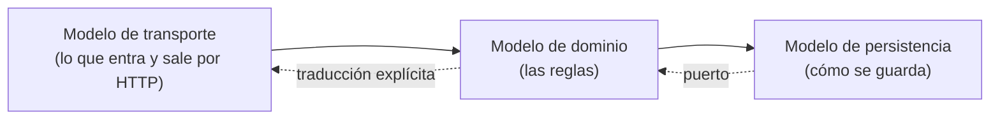

# Módulo 06 — Persistencia y dominio

> El ORM no es el enemigo ni la solución. Es un mapeador entre dos modelos que
> no encajan del todo, y el precio de olvidarlo se paga siempre en producción.

## Prerrequisitos y nivel

**Nivel:** intermedio. **Duración:** 14 horas. Requiere los módulos 02 y 05.

## Objetivos observables

1. Distinguir modelo de dominio, modelo de persistencia y modelo de transporte,
   y explicar por qué conviene que no sean el mismo objeto [@evans-ddd].
2. Elegir entre registro activo y mapeador de datos según el caso, con
   argumentos [@fowler-poeaa].
3. Escribir una migración reversible y desplegarla sin detener el servicio
   [@ambler-sadalage-refactoring-databases].
4. Explicar qué garantiza y qué no garantiza cada nivel de aislamiento
   transaccional [@kleppmann-ddia].
5. Delimitar un agregado y justificar su frontera de consistencia
   [@vernon-iddd].

## Concepto independiente del framework



Los tres modelos coinciden al principio de un proyecto y divergen después. Forzar
que sigan siendo el mismo objeto produce dos síntomas conocidos: campos de la
base de datos filtrados en la API, y reglas de negocio contorsionadas para
encajar en una tabla [@khononov-learning-ddd].

### Registro activo frente a mapeador de datos

| | Registro activo | Mapeador de datos |
| --- | --- | --- |
| El objeto sabe cómo guardarse | Sí | No |
| Velocidad inicial | Alta | Menor |
| Prueba del dominio sin base de datos | Difícil | Directa |
| Dominio rico con invariantes | Se degrada | Se sostiene |
| Encaja bien en | CRUD, prototipos, aplicaciones de contenido | Reglas complejas, invariantes fuertes |

Ambos están descritos como patrones desde hace más de veinte años
[@fowler-poeaa]. La elección no es de moda: es de cuánta lógica tiene el dominio.

### El agregado y su frontera

Un **agregado** es el conjunto de objetos que debe cambiar junto para que una
regla se mantenga cierta. Su frontera define exactamente qué se guarda en una
transacción [@vernon-iddd].

Regla práctica: **una transacción, un agregado**. Si necesitas modificar dos
agregados a la vez para mantener una invariante, o la frontera está mal trazada
o esa invariante debe volverse consistencia eventual, con su compensación
explícita.

### Aislamiento: lo que compras y lo que no

| Nivel | Evita | **No** evita |
| --- | --- | --- |
| Lectura confirmada | Leer datos no confirmados | Lecturas no repetibles, actualizaciones perdidas |
| Lectura repetible / instantánea | Que un dato leído cambie durante la transacción | Sesgo de escritura entre filas distintas |
| Serializable | Todas las anomalías de concurrencia | Nada; se paga en contención o reintentos |

El fallo característico: leer, decidir en la aplicación y escribir, sin bloqueo
ni comprobación. Dos peticiones simultáneas leen lo mismo, ambas deciden que la
operación es válida, y la invariante se rompe sin que nadie vea un error
[@kleppmann-ddia]. Los nombres y garantías exactas varían por motor: consúltalos
en su documentación antes de asumirlos [@postgresql-docs].

## Anatomía comparada

| Aspecto | ORM de registro activo | ORM de mapeador | Consultas directas |
| --- | --- | --- | --- |
| Prueba sin base de datos | Requiere doble o base en memoria | Dominio puro, repositorio sustituible | Depende del diseño |
| Consulta compleja | Escotilla a SQL | Escotilla a SQL | Es lo natural |
| Migraciones | Generadas desde el modelo | Generadas o escritas | Escritas |
| Riesgo de N+1 | Alto, y silencioso | Alto, y silencioso | Bajo: la consulta es visible |
| Curva | Suave al empezar | Más pronunciada | Requiere saber SQL |
| Dónde duele | Cuando el dominio crece | Al principio | En el mantenimiento del texto SQL |

El problema de la consulta N+1 —una consulta para la lista y una por elemento—
aparece en todos los mapeadores y no se ve en desarrollo con diez filas. Se
detecta contando consultas en una prueba, no leyendo el código.

## Implementación mínima

Puerto en el dominio, adaptador en la infraestructura. El dominio no sabe si hay
una base de datos detrás:

```javascript
// dominio/tareas.mjs — ninguna importación de infraestructura
export function crearServicioDeTareas({ repositorio, reloj }) {
  return {
    async crear({ title }) {
      const limpio = String(title ?? "").trim();
      if (!limpio) throw Object.assign(new Error("title requerido"), { code: "TITLE_REQUIRED" });
      // La invariante vive aquí, no en un disparador de la base de datos ni
      // en el controlador: es la regla que sería cierta también en papel.
      if (await repositorio.existeConTitulo(limpio)) {
        throw Object.assign(new Error("título duplicado"), { code: "TITLE_DUPLICATED" });
      }
      return repositorio.guardar({ title: limpio, done: false, createdAt: reloj.ahora() });
    },
  };
}
```

```javascript
// infraestructura/repositorio-memoria.mjs — el doble de prueba ES un adaptador
export function repositorioEnMemoria() {
  const filas = new Map();
  let siguiente = 1;
  return {
    async existeConTitulo(title) {
      return [...filas.values()].some((fila) => fila.title === title);
    },
    async guardar(tarea) {
      const id = `t${siguiente++}`;
      const fila = { id, ...tarea };
      filas.set(id, fila);
      return fila;
    },
  };
}
```

El servicio se prueba con el adaptador en memoria y se despliega con el adaptador
real. Nada del dominio cambia entre ambos: eso es lo que hace posible probarlo en
milisegundos.

### Migración reversible en cuatro pasos

Renombrar una columna sin detener el servicio, con las versiones antigua y nueva
del código conviviendo [@ambler-sadalage-refactoring-databases]:

```sql
-- Paso 1: añadir la columna nueva. Nadie la usa todavía.
ALTER TABLE tasks ADD COLUMN title_text TEXT;

-- Paso 2: copiar por lotes. Un UPDATE sobre toda la tabla bloquea.
UPDATE tasks SET title_text = title WHERE title_text IS NULL AND id IN (...);

-- Paso 3: la aplicación escribe en ambas y lee de la nueva. Desplegar.

-- Paso 4: cuando ninguna versión antigua sigue viva, retirar la antigua.
ALTER TABLE tasks DROP COLUMN title;
```

Cada paso es reversible por sí solo. Una migración que solo puede avanzar
convierte cualquier fallo de despliegue en una incidencia de datos.

## Pruebas compartidas

1. **Dominio sin base de datos.** Las reglas se prueban con el adaptador en
   memoria, sin contenedor ni servidor.
2. **Contrato del repositorio.** La misma batería de pruebas se ejecuta contra el
   adaptador en memoria y contra el real: si ambos pasan, el doble es fiel.
3. **Invariante bajo concurrencia.** Dos operaciones simultáneas que compiten por
   la misma invariante; una debe fallar con un código claro, no ambas triunfar.
4. **Conteo de consultas.** Cargar una lista de veinte elementos con sus
   relaciones ejecuta un número acotado de consultas, no veintiuna.
5. **Migración de ida y vuelta.** Aplicar y revertir cada migración deja el
   esquema y los datos en el estado previo.
6. **Datos reales de tamaño.** Al menos una prueba con volumen suficiente para
   que un plan de consulta ineficiente se note.

## Seguridad y accesibilidad

- **Consultas parametrizadas, siempre.** Concatenar texto en una consulta es la
  vía directa a la inyección. Los ORM parametrizan por omisión; sus escotillas a
  SQL crudo, no [@postgresql-docs].
- **Menor privilegio.** La aplicación no necesita permisos para alterar el
  esquema en tiempo de ejecución. Separa las credenciales de migración de las de
  operación.
- **Datos personales.** Decide desde el modelo qué se guarda, cuánto tiempo y
  cómo se borra. Un campo que nunca se borra es una decisión, aunque nadie la
  haya tomado conscientemente.
- **Errores y accesibilidad.** Una violación de unicidad debe llegar a la
  interfaz como un error **de ese campo**, no como un `500`. Si el repositorio se
  traga el detalle, el formulario no puede señalar dónde está el problema.
- **Copias de seguridad probadas.** Una copia que nunca se ha restaurado no es
  una copia de seguridad: es una suposición.

## Errores frecuentes y diagnóstico

| Síntoma | Causa | Diagnóstico |
| --- | --- | --- |
| Rápido en desarrollo, lento en producción | Consulta N+1 | Cuenta consultas por caso de uso en una prueba |
| Invariante rota sin ningún error registrado | Leer, decidir y escribir sin protección | Añade restricción en la base **y** control de concurrencia [@kleppmann-ddia] |
| Campos internos filtrados en la API | Un solo modelo para los tres usos | Separa transporte, dominio y persistencia [@evans-ddd] |
| Las pruebas del dominio tardan minutos | El dominio depende de la base | Introduce el puerto y el adaptador en memoria |
| Un despliegue fallido deja datos inconsistentes | Migración no reversible | Divide en pasos aditivos y reversibles |
| Reglas de negocio en disparadores de la base | El dominio se fue a la infraestructura | Devuélvelas al dominio; deja en la base las restricciones de integridad |
| Lecturas complejas deforman el modelo de escritura | Un solo modelo para leer y escribir | Considera separar ambos caminos [@fowler-cqrs] |
| El doble de prueba pasa y el real falla | El doble no es fiel | Ejecuta el mismo contrato contra ambos |

## Comprobación de recuerdo

1. ¿Cuáles son los tres modelos y por qué conviene separarlos?
2. ¿Qué determina la frontera de un agregado?
3. ¿Qué anomalía **no** evita el nivel de lectura repetible?
4. Enumera los cuatro pasos de un renombrado sin detener el servicio.
5. ¿Cómo se detecta una consulta N+1 sin mirar el código?

**Repaso espaciado.** Repite al terminar el módulo 08 y antes del módulo 10.

## Reto de transferencia

Sobre TaskFlow, añade la regla «un usuario no puede tener dos tareas pendientes
con el mismo título» y entrega:

1. dónde colocaste la invariante y por qué;
2. la restricción en la base de datos que la respalda;
3. una prueba que la viole con **dos peticiones concurrentes** y demuestre que
   solo una gana;
4. la migración reversible que introduce la restricción sobre datos existentes
   que ya la incumplen —decide y documenta qué haces con ellos;
5. la misma solución con un ORM de registro activo y con un mapeador,
   comparando cuánto código propio requirió cada uno [@fowler-poeaa].

## Criterios de evaluación

| Criterio | Insuficiente | Suficiente | Sólido | Ejemplar |
| --- | --- | --- | --- | --- |
| Separación de modelos | Un solo objeto para todo | Separa transporte y dominio | Separa los tres y traduce explícitamente | Justifica cada traducción por su coste |
| Concurrencia | No se considera | Conoce los niveles | Prueba la invariante bajo concurrencia | Elige el mecanismo midiendo contención |
| Migraciones | Solo hacia delante | Reversibles | Aditivas, por pasos, sin detener servicio | Probadas de ida y vuelta con datos reales |
| Rendimiento | No se mide | Detecta lentitud | Cuenta consultas por caso de uso | Fija un presupuesto y lo verifica en integración |

## Fuentes

- [@kleppmann-ddia] Kleppmann, Martin. *Designing Data-Intensive Applications*. O'Reilly Media, 2017. ISBN 9781449373320 — <https://openlibrary.org/isbn/9781449373320>
- [@evans-ddd] Evans, Eric. *Domain-Driven Design: Tackling Complexity in the Heart of Software*. Addison-Wesley, 2003. ISBN 9780321125217 — <https://openlibrary.org/isbn/9780321125217>
- [@vernon-iddd] Vernon, Vaughn. *Implementing Domain-Driven Design*. Addison-Wesley Professional, 2012. ISBN 9780321834577 — <https://openlibrary.org/isbn/9780321834577>
- [@khononov-learning-ddd] Khononov, Vlad. *Learning Domain-Driven Design*. O'Reilly Media, 2021. ISBN 9781098100131 — <https://openlibrary.org/isbn/9781098100131>
- [@fowler-poeaa] Fowler, Martin. *Patterns of Enterprise Application Architecture*. Addison-Wesley, 2002. ISBN 9780321127426 — <https://openlibrary.org/isbn/9780321127426>
- [@ambler-sadalage-refactoring-databases] Ambler, Scott W.; Sadalage, Pramod J. *Refactoring Databases: Evolutionary Database Design*. Addison-Wesley, 2006. ISBN 9780321293534 — <https://openlibrary.org/isbn/9780321293534>
- [@fowler-cqrs] Fowler, Martin. *CQRS*, 2011 — <https://martinfowler.com/bliki/CQRS.html>
- [@postgresql-docs] PostgreSQL Documentation, PostgreSQL Global Development Group — <https://www.postgresql.org/docs/current/>
