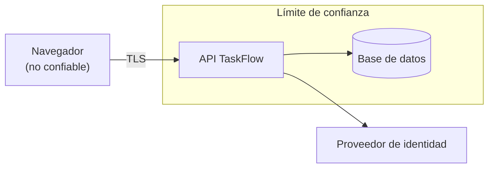

# Módulo 07 — Identidad y seguridad

> Regla del programa: no se enseña a escribir autenticación propia para
> productos con identidad real. Se enseña el modelo de amenazas, los estándares
> y cómo verificar que lo que usas los cumple.

## Prerrequisitos y nivel

**Nivel:** avanzado. **Duración:** 16 horas. Requiere los módulos 01, 05 y 06.

## Objetivos observables

1. Construir un modelo de amenazas de TaskFlow con las cuatro preguntas del
   método y proponer una mitigación por amenaza [@shostack-threat-modeling].
2. Distinguir autenticación, autorización, sesión y federación, y decir qué
   estándar cubre cada una [@rfc6749].
3. Elegir entre sesión con cookie y token, justificando con el modelo de
   amenazas y no con la costumbre [@rfc6265], [@rfc7519].
4. Verificar una implementación contra requisitos publicados en vez de contra
   una intuición [@owasp-asvs].
5. Escribir pruebas de seguridad que fallen cuando falta un control.

## Concepto independiente del framework

### Las cuatro preguntas

El método cabe en cuatro preguntas, y ninguna requiere herramientas
[@shostack-threat-modeling]:

1. **¿Qué estamos construyendo?** Un diagrama con los límites de confianza.
2. **¿Qué puede salir mal?** Amenazas por cada flujo que cruza un límite.
3. **¿Qué vamos a hacer al respecto?** Una mitigación, o aceptar el riesgo por
   escrito.
4. **¿Lo hicimos bien?** Una prueba que falle si la mitigación desaparece.



Cada flecha que cruza el recuadro es una amenaza que hay que nombrar. Las que
quedan dentro también, pero con otro perfil.

### Los cuatro conceptos que se confunden

| Concepto | Pregunta que responde | Norma de referencia |
| --- | --- | --- |
| **Autenticación** | ¿Quién eres? | Directrices de identidad digital [@nist-800-63b] |
| **Autorización** | ¿Qué puedes hacer? | Marco de autorización [@rfc6749] |
| **Sesión** | ¿Sigues siendo quien dijiste? | Gestión de estado en HTTP [@rfc6265] |
| **Federación** | ¿Quién responde por ti? | Delegación con proveedor externo [@rfc6749] |

Un token no es una sesión, y delegar en un proveedor externo no elimina la
autorización: sigues decidiendo tú qué puede hacer cada identidad.

### Cookie de sesión frente a token en el cliente

| | Cookie de sesión | Token guardado por la aplicación |
| --- | --- | --- |
| Dónde vive | Almacén del navegador, con banderas [@rfc6265] | Memoria o almacenamiento local |
| Revocación | Inmediata: se borra del servidor | Difícil antes de que caduque [@rfc7519] |
| Riesgo principal | Petición forzada entre sitios | Robo del token por inyección de guion |
| Mitigación clave | `HttpOnly`, `Secure`, `SameSite`, testigo anti-falsificación | Vida corta, rotación, no guardarlo donde lo lea un guion |
| Encaja en | Aplicaciones servidas por el mismo origen | Clientes nativos y terceros |

`HttpOnly` impide que un guion lea la cookie; `Secure` impide enviarla sin TLS
[@rfc8446]; `SameSite` limita el envío desde otros sitios. Las tres son
necesarias, ninguna sobra.

### OAuth 2.0 y lo que cambió

El marco original describe varios flujos [@rfc6749]; la práctica actual
recomendada descarta explícitamente algunos de ellos y exige comprobaciones
adicionales, como la verificación exacta de la URI de redirección y el uso del
intercambio con verificador de código para clientes públicos [@rfc9700].
Implementar el marco de 2012 sin sus prácticas actuales produce una
implementación conforme y vulnerable a la vez.

## Anatomía comparada

| Aspecto | Framework con módulo de identidad | Framework minimalista | Proveedor externo |
| --- | --- | --- | --- |
| Quién guarda credenciales | Tu base de datos | Tu base de datos | El proveedor |
| Coste de hacerlo mal | Alto y tuyo | Alto y tuyo | Menor y compartido |
| Segundo factor | Según el módulo | Lo construyes | Suele venir incluido |
| Rotación y revocación | Según el módulo | La construyes | Del proveedor |
| Dependencia | Del framework | Ninguna | Del proveedor y su disponibilidad |
| Qué debes verificar igual | Autorización, sesión, registro de eventos | Todo | Autorización y el vínculo de identidad |

Ninguna columna te libra de la autorización: quién puede ver y modificar **qué
recurso concreto** es una regla de tu dominio, y ningún proveedor la conoce.

## Implementación mínima

Lo que sí se implementa a mano en este módulo es **autorización** y las
comprobaciones que ningún proveedor puede hacer por ti:

```javascript
// autorizacion.mjs — la decisión es del dominio, no del transporte
export function puedeVer(usuario, tarea) {
  if (!usuario) return false;
  if (usuario.rol === "admin") return true;
  return tarea.ownerId === usuario.id;
}

// El control se aplica sobre el RECURSO, no sobre la ruta. Proteger la ruta
// deja pasar a cualquier usuario autenticado hacia el recurso de otro: es la
// referencia directa insegura a objetos.
export async function obtenerTarea({ usuario, id, repositorio }) {
  const tarea = await repositorio.buscarPorId(id);
  if (!tarea) return { status: 404, body: { code: "TASK_NOT_FOUND" } };
  if (!puedeVer(usuario, tarea)) {
    // Mismo código y mismo tiempo de respuesta que «no existe»: distinguirlos
    // permite enumerar identificadores ajenos.
    return { status: 404, body: { code: "TASK_NOT_FOUND" } };
  }
  return { status: 200, body: tarea };
}
```

Y las cabeceras que el navegador necesita para defenderte:

```javascript
export const cabecerasDeSeguridad = {
  // Sin política de contenido, una inyección de guion se ejecuta sin límites.
  "content-security-policy": "default-src 'self'; object-src 'none'; base-uri 'none'",
  "strict-transport-security": "max-age=31536000; includeSubDomains",
  "x-content-type-options": "nosniff",
  "referrer-policy": "strict-origin-when-cross-origin",
};
```

Los valores concretos y sus alternativas están documentados control por control
[@owasp-cheatsheets].

## Pruebas compartidas

Una prueba de seguridad es la que **falla** cuando el control desaparece.

1. **Sin credencial → 401.** Toda ruta protegida, sin excepción.
2. **Credencial válida, recurso ajeno → 404.** Nunca 403 con detalle que permita
   enumerar.
3. **Token caducado → 401**, y el mensaje no revela por qué exactamente.
4. **Cookie con banderas.** La respuesta de inicio de sesión fija la cookie con
   `HttpOnly`, `Secure` y `SameSite` [@rfc6265].
5. **Cabeceras presentes.** Cada respuesta HTML lleva las cuatro cabeceras.
6. **Ritmo limitado.** Tras N intentos fallidos de autenticación, se responde
   `429` con `Retry-After`.
7. **Sin filtración en errores.** Ninguna respuesta de error contiene traza,
   consulta ni ruta de archivo.
8. **Contraseñas.** Se comprueban contra una lista de comprometidas y no se
   imponen reglas de composición arbitrarias ni caducidad periódica
   [@nist-800-63b].

El punto 8 sorprende a mucha gente: las directrices actuales desaconsejan la
rotación obligatoria sin indicio de compromiso y las reglas de composición,
porque empujan a patrones predecibles.

## Seguridad y accesibilidad

- **Verificar contra una lista publicada.** El estándar de verificación
  [@owasp-asvs] da requisitos numerados por nivel; los diez riesgos más
  frecuentes [@owasp-top10] dan el orden en que suelen aparecer. Entre ambos hay
  una lista de comprobación real, no una intuición.
- **Defensa en profundidad.** Ningún control es suficiente por sí solo. La
  validación, la autorización, las cabeceras y el registro de eventos se
  refuerzan mutuamente [@adkins-building-secure-reliable].
- **Registro sin datos sensibles.** Se registra el evento y el identificador, no
  la credencial, el token ni el contenido personal.
- **Accesibilidad de la autenticación.** Un segundo factor que solo funciona con
  un teléfono concreto excluye a parte de tus usuarios. Un captcha visual sin
  alternativa es una barrera de acceso. Un tiempo de sesión corto sin aviso ni
  posibilidad de extenderlo penaliza a quien necesita más tiempo: los criterios
  de accesibilidad sobre límites de tiempo existen por esto.
- **Mensajes de error inclusivos.** «Credenciales incorrectas» sin distinguir
  usuario de contraseña protege la privacidad; pero la interfaz sí debe indicar
  con claridad, y de forma percibible por un lector de pantalla, que el intento
  falló.

## Errores frecuentes y diagnóstico

| Síntoma | Causa | Diagnóstico |
| --- | --- | --- |
| Un usuario ve el recurso de otro | Autorización sobre la ruta, no sobre el recurso | Prueba con dos usuarios y el identificador cruzado [@hoffman-web-application-security] |
| El cierre de sesión no revoca nada | Token sin lista de revocación ni vida corta | Mide cuánto sigue siendo válido tras cerrar sesión |
| Se puede enumerar qué identificadores existen | 403 y 404 distinguibles | Iguala código y tiempo de respuesta |
| Inyección de guion pese al escape | Escotilla de HTML crudo | Añade política de contenido y audita las escotillas |
| El token viaja en la URL | Comodidad de depuración que quedó | Queda en registros e historial; muévelo a la cabecera |
| «Usamos OAuth, estamos seguros» | Flujo obsoleto sin prácticas actuales | Contrasta con la práctica vigente [@rfc9700] |
| Reglas de contraseña complejas y caducidad mensual | Costumbre heredada | Contrasta con las directrices actuales [@nist-800-63b] |
| Autenticación casera «porque es simple» | Subestimación del problema | Enumera: rotación, revocación, segundo factor, recuperación, registro |

## Comprobación de recuerdo

1. ¿Cuáles son las cuatro preguntas del modelo de amenazas?
2. ¿Por qué un recurso ajeno debe responder 404 y no 403?
3. ¿Qué hace cada una de las tres banderas de la cookie de sesión?
4. ¿Qué desaconsejan hoy las directrices sobre caducidad de contraseñas y por qué?
5. ¿Qué parte de la seguridad **no** delega en un proveedor externo?

**Repaso espaciado.** Repite al terminar el módulo 08 y antes del módulo 12.

## Reto de transferencia

Construye el modelo de amenazas completo de TaskFlow y entrega:

1. el diagrama con los límites de confianza y cada flujo que los cruza;
2. una tabla con al menos ocho amenazas, su mitigación y **la prueba** que falla
   si la mitigación desaparece;
3. la elección entre cookie y token, justificada con dos amenazas concretas de tu
   propia tabla;
4. la verificación de tu implementación contra los requisitos del nivel 1 del
   estándar [@owasp-asvs], señalando los que **no** cumples;
5. un riesgo que decides **aceptar**, con el motivo y quién lo acepta.

El punto 5 es obligatorio: un modelo de amenazas sin riesgos aceptados es un
modelo incompleto o deshonesto.

## Criterios de evaluación

| Criterio | Insuficiente | Suficiente | Sólido | Ejemplar |
| --- | --- | --- | --- | --- |
| Modelo de amenazas | No existe | Lista amenazas genéricas | Amenazas por flujo con mitigación | Incluye riesgos aceptados y quién los acepta |
| Autorización | Solo autenticación | Protege rutas | Protege recursos y lo prueba | Prueba la enumeración y el tiempo de respuesta |
| Estándares | Cita de oídas | Cita la norma | Verifica contra requisitos numerados | Documenta los incumplimientos y su plan |
| Pruebas | No hay | Comprueban el camino feliz | Fallan al quitar el control | Cubren ritmo, filtración y caducidad |

## Fuentes

- [@shostack-threat-modeling] Shostack, Adam. *Threat Modeling: Designing for Security*. Wiley, 2014. ISBN 9781118809990 — <https://openlibrary.org/isbn/9781118809990>
- [@hoffman-web-application-security] Hoffman, Andrew. *Web Application Security*. O'Reilly Media, 2020. ISBN 9781492053118 — <https://openlibrary.org/isbn/9781492053118>
- [@adkins-building-secure-reliable] Adkins, Heather et al. *Building Secure and Reliable Systems*. O'Reilly Media, 2020. ISBN 9781492083122 — <https://openlibrary.org/isbn/9781492083122>
- [@owasp-asvs] Application Security Verification Standard, OWASP — <https://owasp.org/www-project-application-security-verification-standard/>
- [@owasp-top10] OWASP Top 10, OWASP — <https://owasp.org/www-project-top-ten/>
- [@owasp-cheatsheets] OWASP Cheat Sheet Series, OWASP — <https://cheatsheetseries.owasp.org/>
- [@nist-800-63b] SP 800-63B — Digital Identity Guidelines, NIST — <https://pages.nist.gov/800-63-3/sp800-63b.html>
- [@rfc6749] RFC 6749 — The OAuth 2.0 Authorization Framework, IETF, 2012 — <https://www.rfc-editor.org/rfc/rfc6749>
- [@rfc9700] RFC 9700 — Best Current Practice for OAuth 2.0 Security, IETF, 2025 — <https://www.rfc-editor.org/rfc/rfc9700>
- [@rfc7519] RFC 7519 — JSON Web Token (JWT), IETF, 2015 — <https://www.rfc-editor.org/rfc/rfc7519>
- [@rfc6265] RFC 6265 — HTTP State Management Mechanism, IETF, 2011 — <https://www.rfc-editor.org/rfc/rfc6265>
- [@rfc8446] RFC 8446 — TLS 1.3, IETF, 2018 — <https://www.rfc-editor.org/rfc/rfc8446>
