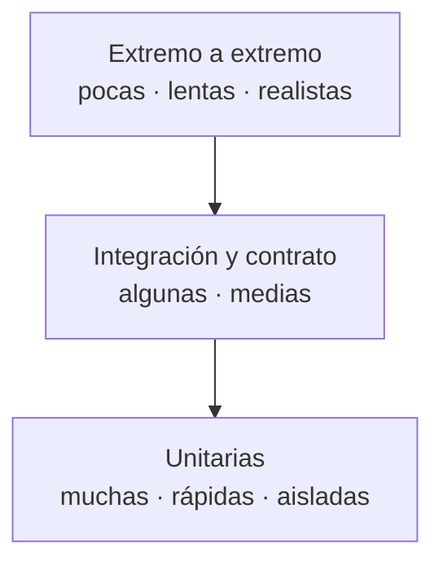

# Módulo 08 — Calidad, rendimiento y operación

> Una comparación de rendimiento sin protocolo de medición declarado no es un
> resultado: es una anécdota con números.

## Prerrequisitos y nivel

**Nivel:** avanzado. **Duración:** 16 horas. Requiere los módulos 05, 06 y 07.

## Objetivos observables

1. Diseñar una estrategia de pruebas por capas y justificar la proporción
   [@fowler-test-pyramid], [@cohn-succeeding-agile].
2. Escribir un doble de prueba adecuado y nombrar de qué tipo es
   [@meszaros-xunit].
3. Declarar un protocolo de medición reproducible antes de comparar
   [@gregg-systems-performance].
4. Instrumentar un servicio con trazas, métricas y registros correlacionados
   [@opentelemetry-docs].
5. Definir un objetivo de nivel de servicio y su presupuesto de error
   [@beyer-sre].

## Concepto independiente del framework

### La pirámide y su razón

La forma no es dogma: es economía. Cuanto más arriba, más realista y más caro en
tiempo, mantenimiento e intermitencia [@fowler-test-pyramid],
[@cohn-succeeding-agile].



| Capa | Qué comprueba | Cuándo falla útilmente | Coste |
| --- | --- | --- | --- |
| Unitaria | Una regla, sin colaboradores reales | Al cambiar la regla | Milisegundos |
| Integración | Que dos piezas reales encajan | Al cambiar el borde entre ellas | Segundos |
| Contrato | Que cliente y servidor siguen de acuerdo | Al evolucionar la API | Segundos |
| Extremo a extremo | Que el camino completo funciona | Al romperse el montaje | Minutos, e intermitencia |

Una suite invertida —muchas pruebas de extremo a extremo y pocas unitarias—
tarda tanto que se acaba desactivando, que es la peor cobertura posible.

### Los cinco dobles, con su nombre

Llamar «mock» a todo impide razonar sobre lo que se está probando
[@meszaros-xunit]:

| Doble | Qué hace | Se usa para |
| --- | --- | --- |
| **Dummy** | Solo rellena un parámetro | Cumplir una firma |
| **Stub** | Devuelve respuestas fijas | Controlar la entrada del sistema bajo prueba |
| **Spy** | Registra cómo lo llamaron | Comprobar a posteriori |
| **Mock** | Espera llamadas concretas y falla si no ocurren | Verificar una interacción obligatoria |
| **Fake** | Implementación real pero simplificada | Sustituir una dependencia costosa |

El adaptador en memoria del módulo 06 es un *fake*, no un *mock*: por eso puede
ejecutarse contra él la misma batería de pruebas de contrato que contra el real.

### Medir: promedio, percentil y protocolo

El promedio de latencia oculta exactamente lo que importa. Si el percentil 99 es
de dos segundos, una de cada cien peticiones tarda dos segundos, y un usuario que
hace cien peticiones en su sesión lo verá con certeza.

Un protocolo de medición reproducible declara [@gregg-systems-performance]:

1. versión exacta del runtime, del framework y del sistema operativo;
2. modo de ejecución: producción en ambos casos, nunca uno depurado;
3. hardware, o tipo de instancia, y si es compartido;
4. estado de la caché: fría o caliente, y cómo se llegó a ese estado;
5. carga: forma, duración, concurrencia y periodo de calentamiento;
6. qué se mide: percentiles, no promedio;
7. número de repeticiones y variación entre ellas.

Sin los siete puntos, dos personas no pueden obtener el mismo resultado, y una
medición irreproducible no es evidencia.

### Los tres pilares y el que falta

Trazas, métricas y registros se complementan [@majors-observability]:

| Señal | Responde a | Coste |
| --- | --- | --- |
| Métrica | ¿Cuánto y con qué tendencia? | Bajo, agregado |
| Traza | ¿Dónde se fue el tiempo de **esta** petición? | Medio |
| Registro | ¿Qué pasó exactamente aquí? | Alto en volumen |

El cuarto elemento, el que suele faltar: un **identificador de correlación** que
atraviese los tres. Sin él, tienes tres fuentes que no puedes cruzar.

## Anatomía comparada

| Aspecto | Framework con lote incluido | Framework minimalista | Sin framework |
| --- | --- | --- | --- |
| Ejecutor de pruebas | Incluido y configurado | Se elige | Del runtime |
| Dobles | Utilidades propias | Biblioteca externa | Escritos a mano |
| Instrumentación | Automática por convención | Manual o con complemento | Manual |
| Riesgo | Instrumentación que no entiendes | Olvidos | Todo es olvido posible |
| Ventaja | Arranque inmediato | Control | Comprensión total |

Al comparar rendimiento entre estas columnas: la instrumentación automática tiene
un coste que forma parte del número. Medir uno con instrumentación y otro sin
ella no compara frameworks, compara configuraciones.

## Implementación mínima

Un objetivo de nivel de servicio y su presupuesto de error, calculados
[@beyer-sre]:

```javascript
// slo.mjs — node slo.mjs
export function presupuestoDeError({ objetivo, peticionesPorMes }) {
  if (objetivo <= 0 || objetivo >= 1) throw new Error("el objetivo es una fracción entre 0 y 1");
  const fallosPermitidos = Math.floor(peticionesPorMes * (1 - objetivo));
  const minutosDelMes = 30 * 24 * 60;
  return {
    fallosPermitidos,
    // El presupuesto traducido a tiempo es lo que hace la conversación posible
    // con quien no razona en peticiones.
    minutosDeIndisponibilidad: Math.round(minutosDelMes * (1 - objetivo)),
  };
}

console.log(presupuestoDeError({ objetivo: 0.999, peticionesPorMes: 10_000_000 }));
// { fallosPermitidos: 10000, minutosDeIndisponibilidad: 43 }
```

Ese número cambia la discusión: «43 minutos al mes» es una decisión de producto,
no una aspiración. Y si el presupuesto ya se gastó, la respuesta correcta es
dejar de desplegar funcionalidad hasta recuperarlo.

Medición de percentiles sin dependencias:

```javascript
export function percentil(muestras, p) {
  if (!muestras.length) throw new Error("sin muestras");
  const orden = [...muestras].sort((a, b) => a - b);
  // Índice por rango más cercano: sin interpolación, para que el número
  // corresponda siempre a una medición real y no a una construida.
  const indice = Math.ceil((p / 100) * orden.length) - 1;
  return orden[Math.min(Math.max(indice, 0), orden.length - 1)];
}
```

## Pruebas compartidas

1. **Suite rápida.** Las unitarias completas terminan en menos de diez segundos;
   si no, dejarán de ejecutarse.
2. **Sin intermitencia.** La suite se ejecuta veinte veces seguidas con el mismo
   resultado. Una prueba intermitente que se reintenta es ruido con permiso.
3. **Contrato en ambos lados.** Las pruebas de contrato se ejecutan contra todas
   las implementaciones del repositorio.
4. **Doble fiel.** La misma batería pasa contra el *fake* y contra el real.
5. **Presupuesto de rendimiento.** Existe un umbral declarado de percentil 95 y
   la integración continua falla si se supera.
6. **Correlación.** Una petición produce traza, métrica y registro con el mismo
   identificador, y puede seguirse de extremo a extremo.
7. **Degradación.** Al caer una dependencia, el servicio responde con error
   controlado y no agota su propio pozo de conexiones [@nygard-release-it].

## Seguridad y accesibilidad

- **La telemetría es un canal de fuga.** Una traza con el cuerpo completo de la
  petición exporta datos personales a un tercero. Define qué se registra antes de
  instrumentar [@opentelemetry-docs].
- **Los registros son datos personales.** Retención, acceso y borrado de los
  registros necesitan la misma política que la base de datos.
- **Fallar sin arrastrar.** Un tiempo de espera ausente convierte la lentitud de
  una dependencia en la caída de todo el servicio. Tiempo de espera, reintento
  con espera creciente, y corte del circuito son controles de disponibilidad,
  que es un atributo de seguridad [@nygard-release-it].
- **Rendimiento y accesibilidad.** Las métricas centradas en el usuario
  [@webdev-vitals] afectan de forma desproporcionada a quien usa dispositivos
  modestos o redes lentas: una regresión de rendimiento es una regresión de
  acceso.
- **Revisión de código como control.** Una revisión con criterios explícitos
  detecta antes lo que ninguna prueba automática busca [@google-eng-practices].

## Errores frecuentes y diagnóstico

| Síntoma | Causa | Diagnóstico |
| --- | --- | --- |
| La suite tarda tanto que se salta | Pirámide invertida | Cuenta pruebas por capa y su tiempo |
| Pruebas que fallan de forma aleatoria | Dependencia de tiempo, orden o red | Aísla; una prueba intermitente se arregla o se borra |
| «X es un 40 % más rápido» | Sin protocolo declarado | Exige los siete puntos [@gregg-systems-performance] |
| Promedio bueno, usuarios quejándose | Se mide el promedio | Mide percentiles 95 y 99 |
| La traza no llega al error | Sin identificador de correlación | Propaga el contexto por todo el recorrido |
| Una dependencia lenta tumba el servicio | Sin tiempo de espera ni corte | Añade límites y pruébalos con fallo inyectado |
| Se despliega los viernes con miedo | Entrega sin automatizar | Automatiza la canalización [@humble-farley-continuous-delivery] |
| «Vamos más rápido si probamos menos» | Falsa disyuntiva | Contrasta con la evidencia [@forsgren-accelerate], [@dora-research] |
| El objetivo de servicio no cambia nada | Sin presupuesto ni consecuencia | Define qué se detiene al agotarlo [@google-sre-books] |
| Diseño imposible de probar | Se probó después | Escribe la prueba antes y observa cómo cambia el diseño [@beck-tdd] |

## Comprobación de recuerdo

1. ¿Por qué la pirámide tiene esa forma? Da la razón económica.
2. Distingue *stub*, *mock* y *fake* con un ejemplo de cada uno.
3. Enumera cinco de los siete puntos de un protocolo de medición.
4. ¿Qué añade el identificador de correlación a los tres pilares?
5. ¿Qué debe ocurrir cuando se agota el presupuesto de error?

**Repaso espaciado.** Repite al terminar el módulo 11 y antes del proyecto final.

## Reto de transferencia

Compara **dos** implementaciones de TaskFlow del módulo 05 y entrega un informe
que un tercero pueda reproducir:

1. el protocolo de medición completo, con los siete puntos;
2. percentiles 50, 95 y 99 de latencia, con tres repeticiones y su variación;
3. uso de memoria y tiempo de arranque en frío;
4. la instrumentación activa en cada una, y qué parte del número es suya;
5. un objetivo de nivel de servicio propuesto con su presupuesto de error
   [@beyer-sre];
6. **una conclusión que no puedas sostener** con tus datos, y por qué la
   descartas.

El punto 6 es el criterio del módulo: distinguir lo medido de lo supuesto.

## Criterios de evaluación

| Criterio | Insuficiente | Suficiente | Sólido | Ejemplar |
| --- | --- | --- | --- | --- |
| Estrategia de pruebas | Solo extremo a extremo o ninguna | Cubre lo principal | Pirámide justificada, suite rápida | Sin intermitencia y con presupuesto en integración |
| Medición | Números sin contexto | Declara entorno | Protocolo completo y percentiles | Reproducible por un tercero, con variación |
| Observabilidad | Registros sueltos | Métricas básicas | Tres señales correlacionadas | Presupuesto de error con consecuencia operativa |
| Resiliencia | Sin límites | Tiempos de espera | Reintento con espera creciente y corte | Fallo inyectado y degradación probada |

## Fuentes

- [@beck-tdd] Beck, Kent. *Test-Driven Development: By Example*. Addison-Wesley, 2002. ISBN 9780321146533 — <https://openlibrary.org/isbn/9780321146533>
- [@meszaros-xunit] Meszaros, Gerard. *xUnit Test Patterns: Refactoring Test Code*. Addison-Wesley Professional, 2007. ISBN 9780131495050 — <https://openlibrary.org/isbn/9780131495050>
- [@cohn-succeeding-agile] Cohn, Mike. *Succeeding with Agile*. Addison-Wesley, 2009. ISBN 9780321579362 — <https://openlibrary.org/isbn/9780321579362>
- [@fowler-test-pyramid] Fowler, Martin. *Test Pyramid*, 2012 — <https://martinfowler.com/bliki/TestPyramid.html>
- [@humble-farley-continuous-delivery] Humble, Jez; Farley, David. *Continuous Delivery*. Addison-Wesley Professional, 2010. ISBN 9780321601919 — <https://openlibrary.org/isbn/9780321601919>
- [@forsgren-accelerate] Forsgren, Nicole; Humble, Jez; Kim, Gene. *Accelerate: The Science of Lean Software and DevOps*. IT Revolution Press, 2018. ISBN 9781942788355 — <https://openlibrary.org/isbn/9781942788355>
- [@dora-research] DORA Research Program, Google Cloud — <https://dora.dev/research/>
- [@beyer-sre] Beyer, Betsy et al. *Site Reliability Engineering*. O'Reilly Media, 2016. ISBN 9781491929124 — <https://openlibrary.org/isbn/9781491929124>
- [@google-sre-books] Google SRE Books, Google — <https://sre.google/books/>
- [@gregg-systems-performance] Gregg, Brendan. *Systems Performance*, 2.ª ed. Pearson, 2020. ISBN 9780136820154 — <https://openlibrary.org/isbn/9780136820154>
- [@majors-observability] Majors, Charity; Fong-Jones, Liz; Miranda, George. *Observability Engineering*. O'Reilly Media, 2022. ISBN 9781492076445 — <https://openlibrary.org/isbn/9781492076445>
- [@opentelemetry-docs] OpenTelemetry Documentation, CNCF — <https://opentelemetry.io/docs/>
- [@webdev-vitals] *Web Vitals*, Google — web.dev — <https://web.dev/articles/vitals>
- [@nygard-release-it] Nygard, Michael T. *Release It!*, 2.ª ed. Pragmatic Bookshelf, 2018. ISBN 9781680502398 — <https://openlibrary.org/isbn/9781680502398>
- [@google-eng-practices] Google Engineering Practices Documentation, Google — <https://google.github.io/eng-practices/>
