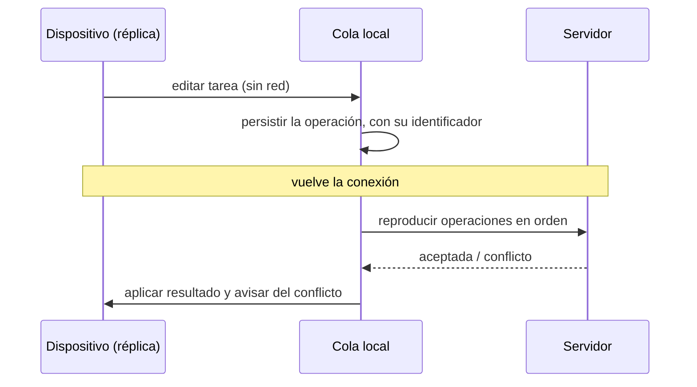

# Módulo 09 — Móvil, escritorio y offline

> Trabajar sin conexión no es guardar una copia. Es aceptar que habrá dos
> versiones de la verdad y decidir, de antemano, qué ocurre cuando difieren.

## Prerrequisitos y nivel

**Nivel:** avanzado. **Duración:** 12 horas. Requiere los módulos 03, 05 y 06.

## Objetivos observables

1. Comparar los enfoques multiplataforma según cinco dimensiones y elegir uno
   para un caso dado, con su coste declarado.
2. Implementar una estrategia de caché explícita y justificar cuál se usa en cada
   recurso [@webdev-offline-cookbook].
3. Diseñar una cola de operaciones pendientes que sobreviva al cierre de la
   aplicación.
4. Definir una política de resolución de conflictos y explicar qué pierde
   [@kleppmann-ddia].
5. Argumentar cuándo la propiedad local de los datos es un requisito y no una
   preferencia [@inkandswitch-local-first].

## Concepto independiente del framework

Sin conexión, el dispositivo deja de ser un cliente y pasa a ser una **réplica**.
Toda la dificultad viene de ahí.



### Tres decisiones que hay que tomar por escrito

| Decisión | Opciones | Qué se pierde |
| --- | --- | --- |
| **Qué se guarda** | Todo, lo reciente, lo marcado | Espacio del dispositivo o disponibilidad |
| **Qué se puede hacer sin red** | Solo leer, leer y encolar, todo | Complejidad de conflictos |
| **Quién gana en conflicto** | Servidor, cliente, marca temporal, fusión, el usuario | Cambios silenciosamente descartados |

«Gana la última escritura» es la opción más común y la que más datos pierde en
silencio: dos relojes distintos deciden qué edición desaparece
[@kleppmann-ddia]. Es aceptable solo si se ha decidido conscientemente y el
usuario puede enterarse.

### Estrategias de caché

| Estrategia | Comportamiento | Adecuada para |
| --- | --- | --- |
| Solo caché | No va a la red | Recursos con huella en el nombre |
| Solo red | Nunca guarda | Operaciones de escritura |
| Caché y si falla, red | Rápido, puede estar obsoleto | Recursos de la aplicación |
| Red y si falla, caché | Fresco, degrada bien | Datos que cambian |
| Obsoleto mientras revalida | Responde ya y actualiza detrás | Listados |

Un trabajador de servicio [@w3c-service-worker] es un intermediario que tú
programas: intercepta cada petición y decide con cuál de estas cinco responde
[@webdev-offline-cookbook]. Su ciclo de vida —instalación, activación, control—
es la fuente de la mayoría de los errores de «no se actualiza» [@mdn-web-docs].

## Anatomía comparada

| Dimensión | Web progresiva | Multiplataforma nativo compilado | Puente a componentes nativos | Contenedor de escritorio web | Nativo por plataforma |
| --- | --- | --- | --- | --- | --- |
| Distribución | URL, sin tienda | Tienda | Tienda | Instalador | Tienda |
| Acceso al dispositivo | El que expone la plataforma web | Amplio | Amplio | Amplio | Total |
| Un código, ¿cuántos destinos? | Todos con navegador | Varios | Varios | Escritorio | Uno |
| Coste de actualización | Inmediato | Revisión de tienda | Revisión de tienda | Actualizador propio | Revisión de tienda |
| Riesgo característico | Capacidades no disponibles | Desfase con la plataforma | Coste del puente | Tamaño y memoria | Coste multiplicado por plataforma |

La pregunta de selección no es «¿cuál es mejor?» sino: **¿qué capacidad del
dispositivo necesitas, con qué frecuencia actualizas y cuántas plataformas
mantienes?** Cambiar cualquiera de las tres cambia la respuesta.

## Implementación mínima

Cola de operaciones que sobrevive al cierre, con idempotencia real:

```javascript
// cola.mjs — la clave de idempotencia del módulo 01, aquí, es obligatoria
export function crearCola({ almacen, enviar }) {
  const LLAVE = "cola-pendiente";
  const leer = () => JSON.parse(almacen.getItem(LLAVE) ?? "[]");
  const escribir = (items) => almacen.setItem(LLAVE, JSON.stringify(items));

  return {
    encolar(operacion) {
      // El identificador se genera en el CLIENTE y no cambia entre reintentos:
      // es lo que permite al servidor reconocer una operación ya aplicada.
      const item = { id: crypto.randomUUID(), intentos: 0, operacion };
      escribir([...leer(), item]);
      return item.id;
    },

    async sincronizar() {
      const pendientes = leer();
      const restantes = [];
      for (const item of pendientes) {
        try {
          await enviar(item.operacion, { idempotencyKey: item.id });
        } catch (error) {
          // Un fallo de red se reintenta; un rechazo del servidor no: repetirlo
          // mil veces no lo va a hacer válido.
          if (error.permanente) continue;
          restantes.push({ ...item, intentos: item.intentos + 1 });
        }
      }
      escribir(restantes);
      return { enviadas: pendientes.length - restantes.length, pendientes: restantes.length };
    },
  };
}
```

Distinguir fallo temporal de rechazo permanente es la decisión que evita las dos
patologías clásicas: una cola que reintenta para siempre una operación inválida,
y una cola que descarta trabajo del usuario ante un corte de red.

## Pruebas compartidas

1. **Cierre y reapertura.** Encolar sin red, cerrar la aplicación, reabrir: la
   operación sigue pendiente.
2. **Reintento sin duplicar.** Reproducir la cola dos veces produce un solo
   efecto en el servidor.
3. **Rechazo permanente.** Una operación inválida sale de la cola e informa al
   usuario; no se reintenta indefinidamente.
4. **Conflicto visible.** Editar el mismo recurso en dos réplicas produce el
   resultado documentado por la política, y el usuario se entera.
5. **Actualización de la aplicación.** Con una versión nueva publicada, la
   siguiente apertura la usa; la caché antigua no la bloquea
   [@w3c-service-worker].
6. **Modo avión, ida y vuelta.** El recorrido completo sin red y con red
   recuperada funciona y no pierde datos.

## Seguridad y accesibilidad

- **Lo que se guarda en el dispositivo, se puede leer.** El almacenamiento local
  no es un lugar seguro: un dispositivo compartido o comprometido lo expone.
  Decide qué **no** se guarda nunca sin conexión.
- **Sesión y datos en caché.** Al cerrar sesión hay que borrar la caché de datos
  personales. Una aplicación que muestra los datos del usuario anterior tras
  cerrar sesión tiene una fuga, aunque «esté sin conexión».
- **Configuración por entorno.** Las direcciones y claves públicas se
  parametrizan por entorno, no se incrustan; una aplicación distribuida con la
  configuración de otro entorno es difícil de corregir [@twelve-factor].
- **Estado de conexión perceptible.** «Sin conexión» y «cambios sin sincronizar»
  deben comunicarse con texto, no solo con un color o un icono; y el cambio de
  estado debe anunciarse en una región activa.
- **Conflicto entendible.** Si la resolución la decide el usuario, la interfaz
  tiene que explicar qué hay en cada versión y qué se pierde al elegir. Un
  diálogo de conflicto ininteligible produce pérdida de datos con consentimiento
  formal.

## Errores frecuentes y diagnóstico

| Síntoma | Causa | Diagnóstico |
| --- | --- | --- |
| La aplicación no se actualiza nunca | Ciclo de vida del trabajador de servicio mal entendido | Revisa instalación, activación y control [@w3c-service-worker] |
| Operaciones duplicadas tras reconectar | Cola sin idempotencia | Genera el identificador en el cliente y consérvalo |
| Se pierden ediciones sin aviso | «Gana la última escritura» sin declarar | Documenta la política y hazla visible |
| La cola crece sin fin | No se distingue rechazo permanente | Clasifica los errores antes de reintentar |
| Datos del usuario anterior visibles | Caché no borrada al cerrar sesión | Vincula el ciclo de la caché al de la sesión |
| Funciona en el emulador y falla en el dispositivo | Diferencias de capacidad y de red | Prueba con red limitada y en dispositivo real |
| «Hacemos una aplicación offline» sin más | Las tres decisiones no se tomaron | Escríbelas antes de programar |
| Reloj del dispositivo usado para ordenar | Los relojes divergen | Usa un orden causal o el orden del servidor [@kleppmann-ddia] |

## Comprobación de recuerdo

1. ¿Cuáles son las tres decisiones que hay que tomar por escrito?
2. ¿Por qué el identificador de idempotencia se genera en el cliente?
3. Nombra las cinco estrategias de caché y un uso adecuado de cada una.
4. ¿Qué pierde exactamente «gana la última escritura»?
5. ¿Qué hay que borrar al cerrar sesión en una aplicación con caché local?

**Repaso espaciado.** Repite al terminar el módulo 11 y antes del proyecto final.

## Reto de transferencia

Convierte TaskFlow en una aplicación utilizable sin conexión y entrega:

1. las tres decisiones, escritas antes de programar;
2. la tabla de recursos con su estrategia de caché y el motivo
   [@webdev-offline-cookbook];
3. la cola persistente, con reproducción idempotente probada;
4. la política de conflictos, con una prueba que la demuestre y una captura de
   cómo se le comunica al usuario;
5. la matriz de comparación con al menos tres enfoques multiplataforma para este
   producto, y tu elección justificada;
6. un párrafo sobre si este producto necesita propiedad local de los datos y por
   qué [@inkandswitch-local-first].

## Criterios de evaluación

| Criterio | Insuficiente | Suficiente | Sólido | Ejemplar |
| --- | --- | --- | --- | --- |
| Decisiones | Implícitas | Escritas | Escritas y justificadas con el producto | Se revisan con datos de uso real |
| Sincronización | Se pierde trabajo | La cola funciona | Persistente e idempotente | Distingue fallo temporal de rechazo |
| Conflictos | No se consideran | Política elegida | Política probada | Explicada al usuario de forma comprensible |
| Selección de enfoque | Por preferencia | Por popularidad | Por capacidad, actualización y plataformas | Con coste de mantenimiento estimado |

## Fuentes

- [@w3c-service-worker] Service Workers, W3C — <https://w3c.github.io/ServiceWorker/>
- [@webdev-offline-cookbook] *The Offline Cookbook*, Google — web.dev — <https://web.dev/articles/offline-cookbook>
- [@inkandswitch-local-first] Kleppmann, Martin; Wiggins, Adam; van Hardenberg, Peter; McGranaghan, Mark. *Local-first software: You own your data, in spite of the cloud*. Ink & Switch, 2019 — <https://www.inkandswitch.com/local-first/>
- [@kleppmann-ddia] Kleppmann, Martin. *Designing Data-Intensive Applications*. O'Reilly Media, 2017. ISBN 9781449373320 — <https://openlibrary.org/isbn/9781449373320>
- [@twelve-factor] The Twelve-Factor App — <https://12factor.net/>
- [@mdn-web-docs] MDN Web Docs, Mozilla — <https://developer.mozilla.org/en-US/docs/Web>
