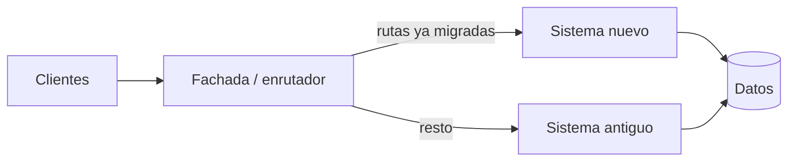

# Módulo 10 — Modernización y migración

> La reescritura completa es la decisión más cara del oficio y casi siempre se
> toma sin comparar su coste con la alternativa incremental. Este módulo enseña
> la alternativa para que la comparación sea posible.

## Prerrequisitos y nivel

**Nivel:** avanzado. **Duración:** 14 horas. Requiere los módulos 05, 06 y 08.

## Objetivos observables

1. Identificar costuras en un sistema sin pruebas y usarlas para poder probarlo
   [@feathers-legacy-code].
2. Diseñar una migración con la figura estranguladora, con su fachada y su
   criterio de retirada [@fowler-strangler-fig].
3. Ejecutar un cambio estructural en pasos pequeños y reversibles
   [@fowler-refactoring].
4. Migrar datos sin detener el servicio y con vuelta atrás posible
   [@ambler-sadalage-refactoring-databases].
5. Definir el criterio objetivo de retirada del sistema antiguo.

## Concepto independiente del framework

### La figura estranguladora

Se coloca una fachada delante del sistema antiguo. Cada capacidad se implementa
en el sistema nuevo y la fachada redirige esa ruta. El sistema antiguo muere
cuando ya no recibe tráfico, no cuando alguien lo declara muerto
[@fowler-strangler-fig].



Tres propiedades que hacen que funcione:

1. **La fachada es reversible.** Devolver una ruta al sistema antiguo es un
   cambio de configuración, no un despliegue de código.
2. **Se migra por capacidad, no por capa.** Migrar «toda la capa de datos» no
   entrega valor ni permite retroceder; migrar «el alta de tareas» sí.
3. **Hay un criterio de retirada.** Escrito antes de empezar: qué porcentaje de
   tráfico, durante cuánto tiempo, con qué tasa de error.

Sin el punto 3 aparece el fallo más común de estas migraciones: dos sistemas
vivos para siempre, y el doble de coste de mantenimiento indefinidamente.

### Costuras

Una **costura** es un punto donde se puede cambiar el comportamiento sin editar
el código de ese lugar [@feathers-legacy-code]. Es lo que permite poner bajo
prueba código que no fue escrito para ser probado.

| Tipo de costura | Dónde está | Cómo se usa |
| --- | --- | --- |
| De objeto | Un parámetro o propiedad | Se pasa un doble |
| De enlace | La resolución de un módulo o clase | Se sustituye en la carga |
| De preprocesado | Construcción o compilación | Se compila otra variante |

El orden de trabajo con código heredado es siempre el mismo: **encontrar la
costura, escribir la prueba de caracterización, y solo entonces cambiar**. La
prueba de caracterización no documenta lo que el código *debería* hacer, sino lo
que *hace*, incluidos sus defectos: es la red que detecta si el cambio alteró
algo.

### Datos: el paso que no se puede improvisar

La migración de código puede revertirse en minutos; la de datos, no. Por eso los
cambios de esquema se hacen aditivos y por pasos, con doble escritura mientras
convivan ambas versiones [@ambler-sadalage-refactoring-databases].

## Anatomía comparada

| Enfoque | Riesgo | Retroalimentación | Coste de vuelta atrás | Cuándo encaja |
| --- | --- | --- | --- | --- |
| Reescritura completa | Muy alto | Al final | Enorme | El sistema antiguo no puede ejecutarse ni entenderse |
| Figura estranguladora | Bajo por paso | Continua | Bajo | La mayoría de los casos |
| Refactorización interna | Muy bajo | Inmediata | Mínimo | El sistema es correcto y solo está mal estructurado |
| Fachada de integración [@hohpe-woolf-eip] | Medio | Media | Medio | Hay que convivir con un tercero que no cambia |

La reescritura completa se elige a menudo por razones que no son técnicas: nadie
quiere mantener el sistema antiguo. Ese motivo es legítimo, pero debe declararse
como lo que es.

## Implementación mínima

Fachada con conmutador por ruta y comparación en la sombra:

```javascript
// fachada.mjs — el enrutamiento vive en configuración, no en el código
const RUTAS_MIGRADAS = new Set((process.env.RUTAS_NUEVAS ?? "").split(",").filter(Boolean));
const SOMBRA = process.env.SOMBRA === "1";

export async function enrutar(peticion, { antiguo, nuevo, registrar }) {
  const clave = `${peticion.method} ${peticion.path}`;

  if (RUTAS_MIGRADAS.has(clave)) {
    return nuevo(peticion);
  }

  const respuesta = await antiguo(peticion);

  // Modo sombra: el sistema nuevo responde también, pero su respuesta NO se
  // entrega. Sirve para medir la diferencia con tráfico real y sin riesgo.
  if (SOMBRA) {
    nuevo(peticion)
      .then((candidata) => {
        if (candidata.status !== respuesta.status) {
          registrar({ clave, esperado: respuesta.status, obtenido: candidata.status });
        }
      })
      .catch((error) => registrar({ clave, error: error.message }));
  }

  return respuesta;
}
```

El modo sombra es lo que convierte una migración en una decisión con datos: se
sabe cuánto difiere el sistema nuevo **antes** de que ningún usuario dependa de
él. Requiere cuidado: si la ruta tiene efectos secundarios, la ejecución en
sombra debe hacerse contra un almacén separado o no hacerse.

Prueba de caracterización sobre código heredado:

```javascript
// caracterizacion.test.mjs — documenta lo que HACE, no lo que debería hacer
test("el cálculo heredado redondea hacia arriba en .5 (comportamiento actual)", () => {
  // Este resultado puede ser un defecto. Se fija igualmente: si el cambio lo
  // altera, quiero enterarme y decidir, no descubrirlo en producción.
  assert.equal(calcularHeredado(2.5), 3);
  assert.equal(calcularHeredado(-2.5), -2);
});
```

## Pruebas compartidas

1. **Paridad de contrato.** El sistema nuevo pasa las mismas pruebas de
   aceptación que el antiguo, sin excepciones ni ramas.
2. **Sombra sin divergencia.** Durante el periodo declarado, la tasa de
   diferencias está por debajo del umbral acordado.
3. **Vuelta atrás.** Devolver una ruta al sistema antiguo se ejecuta y se
   verifica; es un ensayo, no una promesa.
4. **Datos de ida y vuelta.** Cada paso de migración se aplica y se revierte
   sobre una copia de datos reales.
5. **Caracterización.** Existe una prueba por cada comportamiento heredado que se
   ha decidido conservar.
6. **Presupuesto de error durante la migración.** El cambio no consume el
   presupuesto de fiabilidad del servicio [@nygard-release-it].

## Seguridad y accesibilidad

- **Dos sistemas, dos superficies.** Durante la convivencia hay el doble de
  superficie expuesta. Las mitigaciones del módulo 07 se aplican a ambos, y el
  sistema antiguo suele ser el que menos las tiene.
- **La fachada centraliza y concentra.** Es un buen punto para aplicar límites de
  ritmo y cabeceras de seguridad, y también un punto único de fallo: necesita su
  propio tiempo de espera y su corte de circuito [@nygard-release-it].
- **Datos en tránsito entre sistemas.** Un volcado para migrar es una copia
  completa de datos personales. Cifrado, retención y borrado de esa copia forman
  parte del plan, no de la improvisación.
- **Accesibilidad no negociable en la paridad.** Si el sistema antiguo era
  accesible y el nuevo no, la migración es una regresión aunque todas las pruebas
  funcionales pasen. Añade los criterios de accesibilidad a la paridad de
  contrato.
- **Cambios visibles para el usuario.** Migrar por rutas produce interfaces que
  conviven. Las diferencias de navegación y de atajos de teclado entre ambas
  desorientan; documenta cuáles aceptas.

## Errores frecuentes y diagnóstico

| Síntoma | Causa | Diagnóstico |
| --- | --- | --- |
| La migración lleva años y no termina | Sin criterio de retirada | Escríbelo y mide el tráfico por ruta |
| El sistema nuevo se comporta distinto y nadie lo supo | Sin modo sombra | Ejecuta en sombra antes de conmutar |
| No se puede probar el sistema antiguo | Sin costuras identificadas | Busca las tres clases de costura [@feathers-legacy-code] |
| Un cambio «equivalente» rompió algo | Sin prueba de caracterización | Fija el comportamiento actual antes de tocarlo |
| No se puede volver atrás | Migración de datos destructiva | Pasos aditivos y reversibles |
| La reescritura completa se estanca | Todo el valor llega al final | Reconvierte a migración por capacidad |
| Se migró por capas y no se puede entregar nada | Corte vertical ausente | Migra capacidades completas |
| La fachada se cae y cae todo | Punto único sin protección | Tiempos de espera, corte y degradación |

## Comprobación de recuerdo

1. ¿Qué hace que la figura estranguladora sea reversible?
2. ¿Qué es una costura y para qué sirve exactamente?
3. ¿Qué documenta una prueba de caracterización, y qué **no** documenta?
4. ¿Por qué se migra por capacidad y no por capa?
5. ¿Qué debe contener el criterio de retirada del sistema antiguo?

**Repaso espaciado.** Repite antes del módulo 12 y al preparar la defensa final.

## Reto de transferencia

Toma el laboratorio de sistema heredado del repositorio
([`labs/07-legacy-migration/`](../labs/07-legacy-migration/README.md)) y entrega:

1. el mapa de capacidades, ordenadas por valor y riesgo;
2. las costuras encontradas y las pruebas de caracterización escritas;
3. la fachada con conmutador por configuración y modo sombra;
4. la migración de **una** capacidad completa, con su paso de datos reversible;
5. el criterio de retirada, con umbrales numéricos y plazo;
6. un ensayo de vuelta atrás ejecutado, con su registro.

## Criterios de evaluación

| Criterio | Insuficiente | Suficiente | Sólido | Ejemplar |
| --- | --- | --- | --- | --- |
| Estrategia | Propone reescritura sin comparar | Elige incremental | Justifica con riesgo y retroalimentación | Compara costes de ambas alternativas |
| Red de seguridad | Sin pruebas | Algunas pruebas | Caracterización sobre lo que va a cambiar | Sombra con umbral de divergencia medido |
| Datos | Migración destructiva | Reversible | Aditiva, por pasos, probada | Ensayada sobre copia de datos reales |
| Retirada | No se plantea | Se menciona | Criterio numérico y plazo | Verificado con tráfico por ruta |

## Fuentes

- [@fowler-strangler-fig] Fowler, Martin. *Strangler Fig Application*, 2004 — <https://martinfowler.com/bliki/StranglerFigApplication.html>
- [@feathers-legacy-code] Feathers, Michael C. *Working Effectively with Legacy Code*. Prentice Hall, 2004. ISBN 9780131177055 — <https://openlibrary.org/isbn/9780131177055>
- [@fowler-refactoring] Fowler, Martin. *Refactoring: Improving the Design of Existing Code*, 2.ª ed. Addison-Wesley, 2018. ISBN 9780134757599 — <https://openlibrary.org/isbn/9780134757599>
- [@hohpe-woolf-eip] Hohpe, Gregor; Woolf, Bobby. *Enterprise Integration Patterns*. Addison-Wesley, 2003. ISBN 9780321200686 — <https://openlibrary.org/isbn/9780321200686>
- [@ambler-sadalage-refactoring-databases] Ambler, Scott W.; Sadalage, Pramod J. *Refactoring Databases*. Addison-Wesley, 2006. ISBN 9780321293534 — <https://openlibrary.org/isbn/9780321293534>
- [@nygard-release-it] Nygard, Michael T. *Release It!*, 2.ª ed. Pragmatic Bookshelf, 2018. ISBN 9781680502398 — <https://openlibrary.org/isbn/9781680502398>
