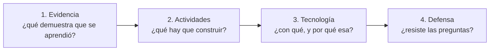

# Módulo 12 — Producto final

> El proyecto final no es «una aplicación más grande». Es la demostración de que
> las decisiones del programa se sostienen ante alguien que pregunta por qué.

## Prerrequisitos y nivel

**Nivel:** avanzado. **Duración:** 10 horas de integración y defensa. Requiere los
módulos 05, 07, 08 y 11, y haber completado los laboratorios de la ruta elegida.

## Objetivos observables

1. Entregar un producto que cumpla el contrato canónico y sus pruebas de
   aceptación sin excepciones.
2. Defender cada decisión de arquitectura con su registro, sus alternativas y sus
   consecuencias [@adr-github].
3. Demostrar la operación del sistema: despliegue, observabilidad, degradación y
   vuelta atrás [@humble-farley-continuous-delivery].
4. Presentar la comparación de dos ecosistemas con un protocolo reproducible.
5. Reconocer por escrito los límites del trabajo y lo que falta para producción.

## Concepto independiente del framework

El proyecto se diseña **desde la evidencia hacia atrás**: primero qué se va a
aceptar como prueba de aprendizaje, después las actividades, y por último la
tecnología [@wiggins-mctighe-ubd]. Elegir el framework primero y buscar después
qué demostrar es la secuencia que produce proyectos vistosos y vacíos.



### Los cuatro productos canónicos

Elige uno de [`projects/canonical-products.md`](../projects/canonical-products.md).
Todos comparten el mismo núcleo de exigencias; cambian los atributos de calidad
dominantes [@bass-software-architecture-practice]:

| Producto | Atributo dominante | Riesgo característico |
| --- | --- | --- |
| Plataforma educativa | Accesibilidad e integridad de progreso | Contenido inaccesible; progreso perdido |
| Comercio electrónico | Consistencia de inventario y pagos | Sobreventa; cargos duplicados |
| Libro contable y pagos | Auditoría e idempotencia | Asientos duplicados; historial mutable |
| Red social | Autorización fina y moderación | Fuga entre visibilidades |
| Panel de agentes | Trazabilidad y control de coste | Acciones sin registro; gasto sin límite |

## Anatomía comparada

La defensa se apoya en una tabla que el evaluador puede recorrer:

| Decisión | Alternativa descartada | Por qué | Consecuencia aceptada | Registro |
| --- | --- | --- | --- | --- |
| Framework del backend | (otro candidato) | Atributo dominante | Lo que se pierde | `docs/adr/000N` |
| Estrategia de renderizado | (otra) | Contenido y audiencia | Lo que se paga | `docs/adr/000N` |
| Persistencia | (otra) | Invariantes del dominio | Lo que se complica | `docs/adr/000N` |
| Identidad | (otra) | Modelo de amenazas | Dependencia asumida | `docs/adr/000N` |
| Despliegue | (otra) | Coste de operación | Complejidad añadida | `docs/adr/000N` |

Una decisión sin alternativa descartada no es una decisión: es lo primero que se
encontró [@richards-ford-fundamentals].

## Implementación mínima

Lo que debe existir, como mínimo, en el repositorio entregado:

```text
producto/
  contracts/            contrato y pruebas de aceptación, sin modificar
  src/dominio/          reglas puras, sin importar el framework
  src/aplicacion/       casos de uso y transacciones
  src/infraestructura/  adaptadores: HTTP, persistencia, identidad
  tests/                unitarias, integración, contrato, aptitud
  docs/adr/             un registro por decisión relevante
  docs/MEDICION.md      protocolo reproducible y resultados
  docs/OPERACION.md     despliegue, vuelta atrás, alertas, presupuesto de error
  docs/LIMITES.md       qué falta para producción, escrito por ti
```

Comprobación de configuración por entorno, sin secretos en el código
[@twelve-factor]:

```javascript
// configuracion.mjs — falla al arrancar, no en la primera petición
const REQUERIDAS = ["DATABASE_URL", "SESSION_SECRET", "PUBLIC_BASE_URL"];

export function cargarConfiguracion(entorno = process.env) {
  const faltan = REQUERIDAS.filter((clave) => !entorno[clave]);
  // Fallar al arrancar convierte un error de configuración en un despliegue que
  // no llega a recibir tráfico, en vez de en una incidencia con usuarios dentro.
  if (faltan.length) throw new Error(`configuración incompleta: ${faltan.join(", ")}`);
  return {
    baseDeDatos: entorno.DATABASE_URL,
    urlPublica: entorno.PUBLIC_BASE_URL,
    entorno: entorno.NODE_ENV ?? "development",
  };
}
```

Y una comprobación de salud que distinga estar **vivo** de estar **listo**, que
es la distinción que usa cualquier orquestador para decidir si enviarte tráfico
[@kubernetes-docs]:

```javascript
export async function estado({ baseDeDatos }) {
  // «vivo» responde siempre que el proceso funcione: si depende de la base de
  // datos, un fallo de esta provoca el reinicio en bucle de un proceso sano.
  const vivo = { status: "ok" };
  const listo = (await baseDeDatos.ping()) ? { status: "ok" } : { status: "degraded", reason: "database" };
  return { vivo, listo };
}
```

## Pruebas compartidas

La entrega no se acepta sin estas siete:

1. **Contrato.** Las pruebas de aceptación canónicas pasan sin modificación.
2. **Aptitud.** Existe una prueba que falla si el dominio importa el framework.
3. **Seguridad.** Las pruebas del módulo 07 pasan: recurso ajeno, cabeceras,
   ritmo limitado, sin filtración.
4. **Accesibilidad.** El recorrido principal se completa solo con teclado y con
   nombres accesibles verificados.
5. **Rendimiento.** Existe un presupuesto declarado de percentil 95 y la
   integración continua falla al superarlo.
6. **Operación.** Un despliegue y una vuelta atrás ejecutados y registrados
   [@nygard-release-it].
7. **Reproducibilidad.** Un tercero clona el repositorio, sigue el `README` y
   llega al mismo resultado.

La séptima es la que más entregas suspende: instrucciones que solo funcionan en
la máquina de quien las escribió.

## Seguridad y accesibilidad

- **Sin secretos en el historial.** Comprueba el historial completo, no solo el
  último commit. Un secreto publicado y luego borrado sigue publicado.
- **Superficie declarada.** Qué puertos, qué orígenes, qué dependencias externas.
  Lo que no se declara no se vigila.
- **Accesibilidad en el criterio de aceptación.** No como revisión final: como
  condición de «terminado» de cada historia.
- **Datos personales.** Qué se guarda, cuánto tiempo, cómo se borra y quién puede
  verlo. Escrito, aunque el proyecto sea académico.
- **Coste como límite operativo.** Si el producto consume servicios de pago,
  necesita un límite de gasto y una alerta; un panel de agentes sin tope es un
  incidente esperando la ocasión.

## Errores frecuentes y diagnóstico

| Síntoma | Causa | Diagnóstico |
| --- | --- | --- |
| El proyecto no arranca en otra máquina | Configuración implícita | Prueba en un entorno limpio antes de entregar |
| Las pruebas de contrato se modificaron | Se cambió el examen | Compara con el contrato canónico |
| «No hubo tiempo» para seguridad o accesibilidad | Se dejaron para el final | Conviértelas en criterio de aceptación desde el inicio |
| Decisiones sin alternativa considerada | Registro escrito a posteriori | Escribe el registro cuando decides, no al entregar |
| Números de rendimiento sin protocolo | Medición improvisada | Aplica el protocolo del módulo 08 |
| Se reinicia en bucle al caer la base de datos | Sondas de vivo y listo confundidas | Sepáralas [@kubernetes-docs] |
| No se puede volver atrás del despliegue | Sin ensayo | Ensáyalo y registra el tiempo que tardó |
| Todo funciona pero nadie entiende por qué se eligió | Defensa sin trazabilidad | Enlaza cada decisión con su registro [@adr-github] |

## Comprobación de recuerdo

1. ¿En qué orden se diseña un proyecto y por qué la tecnología va al final?
2. ¿Qué convierte una elección en una decisión defendible?
3. ¿Cuál es la diferencia entre la sonda de vivo y la de listo?
4. ¿Por qué la reproducibilidad es una prueba y no una cortesía?
5. ¿Qué debe contener el documento de límites?

## Reto de transferencia

La defensa. Treinta minutos ante alguien que ha leído tu repositorio:

1. **Diez minutos de demostración.** Recorrido principal, un fallo provocado y su
   degradación, y una vuelta atrás.
2. **Diez minutos de decisiones.** Tres registros, con sus alternativas y sus
   consecuencias aceptadas.
3. **Diez minutos de preguntas.** Entre ellas, con seguridad, estas cuatro:
   - ¿qué harías distinto con el doble de tráfico?
   - ¿qué parte de esto **no** llevarías a producción tal como está?
   - ¿qué mediste y qué supusiste?
   - ¿qué se rompe si mañana desaparece la dependencia que elegiste?

Responder «no lo sé, no lo medí» a la tercera es una respuesta válida y mejor que
una cifra inventada. Lo que no es válido es no distinguir ambas cosas.

## Criterios de evaluación

| Criterio | Insuficiente | Suficiente | Sólido | Ejemplar |
| --- | --- | --- | --- | --- |
| Cumplimiento del contrato | Pruebas modificadas | Pasan las canónicas | Pasan y añade las suyas | Contrato verificado en integración continua |
| Decisiones | Sin registro | Registro descriptivo | Con alternativas y consecuencias | Registros escritos en el momento de decidir |
| Operación | No se despliega | Se despliega | Despliegue y vuelta atrás ensayados | Observabilidad y presupuesto de error activos |
| Honestidad técnica | Afirma sin evidencia | Distingue medido de supuesto | Documenta límites | Reconoce lo que refutaría su propia conclusión |
| Reproducibilidad | Solo en su máquina | Con ayuda | Un tercero lo consigue siguiendo el `README` | Verificado en un entorno limpio automatizado |

Se aprueba el programa con **Sólido** en cumplimiento del contrato, decisiones y
honestidad técnica.

## Fuentes

- [@bass-software-architecture-practice] Bass, Len; Clements, Paul; Kazman, Rick. *Software Architecture in Practice*, 4.ª ed. Pearson Education, 2021. ISBN 9780136886099 — <https://openlibrary.org/isbn/9780136886099>
- [@richards-ford-fundamentals] Richards, Mark; Ford, Neal. *Fundamentals of Software Architecture*. O'Reilly Media, 2020. ISBN 9781492043454 — <https://openlibrary.org/isbn/9781492043454>
- [@wiggins-mctighe-ubd] Wiggins, Grant; McTighe, Jay. *Understanding by Design*, 2.ª ed. ampliada. ASCD, 2005. ISBN 9781416600350 — <https://openlibrary.org/isbn/9781416600350>
- [@adr-github] Architectural Decision Records — <https://adr.github.io/>
- [@nygard-release-it] Nygard, Michael T. *Release It!*, 2.ª ed. Pragmatic Bookshelf, 2018. ISBN 9781680502398 — <https://openlibrary.org/isbn/9781680502398>
- [@humble-farley-continuous-delivery] Humble, Jez; Farley, David. *Continuous Delivery*. Addison-Wesley Professional, 2010. ISBN 9780321601919 — <https://openlibrary.org/isbn/9780321601919>
- [@twelve-factor] The Twelve-Factor App — <https://12factor.net/>
- [@kubernetes-docs] Kubernetes Documentation, CNCF — <https://kubernetes.io/docs/home/>
