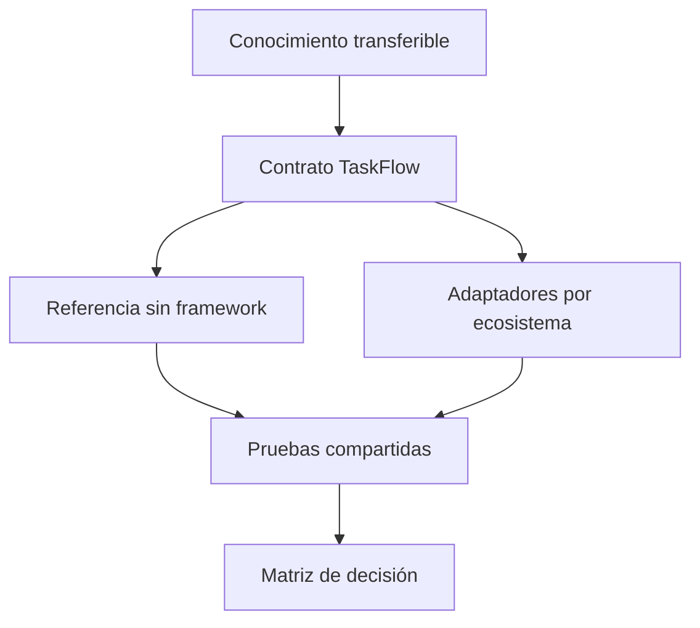

# Arquitectura del repositorio

## Fronteras

- `contracts/` define comportamiento externo y dominio.
- `labs/01-http-contract/` muestra el costo mínimo visible.
- los demás laboratorios agregan abstracciones específicas;
- `catalog/` registra cobertura, no código;
- `curriculum/` organiza competencias;
- `projects/` integra el aprendizaje en productos.

## Arquitectura de adaptadores

Las implementaciones maduras deberían separar:

1. dominio sin dependencias de transporte;
2. casos de uso;
3. puertos de persistencia y servicios;
4. adaptadores HTTP, datos y observabilidad;
5. composición específica del framework.

En módulos iniciales se permiten archivos pequeños, pero debe señalarse la deuda que aparecería al crecer.

## Pruebas

La prueba de contrato se ejecuta contra una URL y no importa módulos internos. Las pruebas unitarias pueden usar APIs idiomáticas del ecosistema. Las comparaciones deben distinguir ambos niveles.

## Evolución

Cambiar el contrato exige compatibilidad, versión o migración. Cambiar una implementación no debe obligar a modificar pruebas funcionales compartidas salvo una desviación aprobada.
