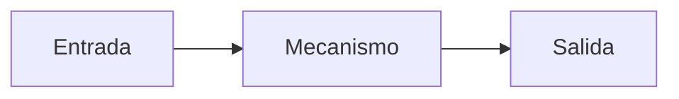

# Módulo NN — Título

> Una frase que diga qué cambia en quien complete el módulo. No un resumen del
> contenido: el cambio observable.

## Prerrequisitos y nivel

**Nivel:** introductorio | intermedio | avanzado. **Duración:** N horas.

Qué hay que saber antes y cómo comprobarlo.

## Objetivos observables

Verbos observables: clasificar, comparar, implementar, medir, justificar,
detectar. Nunca «conocer» ni «entender»: no pueden evaluarse.

1. Objetivo con su evidencia `[@identificador-de-la-fuente]`.
2. …

## Concepto independiente del framework

La idea que sigue siendo cierta si mañana desaparecen todas las herramientas
actuales. Incluye un diagrama cuando aclare el mecanismo:



## Anatomía comparada

Al menos dos enfoques, comparados por **dimensiones explícitas**. La tabla debe
terminar en una fila que nombre el compromiso, no un ganador.

| Aspecto | Enfoque A | Enfoque B |
| --- | --- | --- |
| … | … | … |

## Implementación mínima

Ejemplo resuelto y comentado: el andamiaje se retira después, en el reto. Los
comentarios explican **por qué**, no qué hace la línea.

```javascript
// …
```

## Pruebas compartidas

Las mismas afirmaciones para todos los enfoques comparados. Si una implementación
necesita cambiarlas para pasar, la comparación deja de ser válida.

1. …

## Seguridad y accesibilidad

Qué se rompe y a quién deja fuera. Ambas cosas, siempre: son criterios de
aceptación, no una revisión final.

## Errores frecuentes y diagnóstico

| Síntoma | Causa | Diagnóstico |
| --- | --- | --- |
| … | … | … |

## Comprobación de recuerdo

Cinco preguntas que se responden **de memoria**, antes de volver al texto.

1. …

**Repaso espaciado.** Indica en qué módulos posteriores hay que repetirlas.

## Reto de transferencia

El mismo tipo de trabajo en un contexto que no se practicó, con criterio de
terminado verificable. Incluye siempre un apartado que obligue a declarar un
límite, una desviación o algo que no se pudo medir.

## Criterios de evaluación

| Criterio | Insuficiente | Suficiente | Sólido | Ejemplar |
| --- | --- | --- | --- | --- |
| … | … | … | … | … |

## Fuentes

Cada fuente declarada en el front matter, con su referencia completa y su
localizador. `node scripts/verify-sources.mjs` comprueba que coincidan.

- `[@identificador]` Autoría. *Título*. Editorial, año. ISBN … — <https://…>
